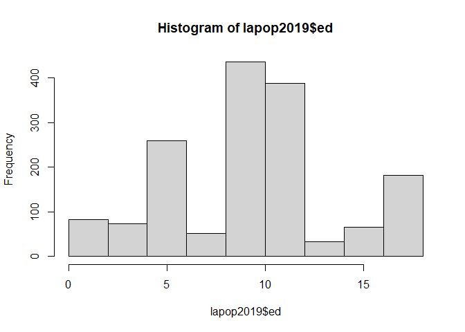
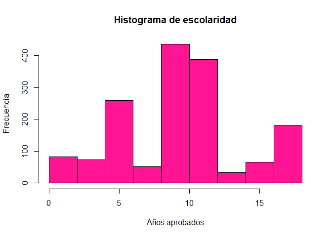
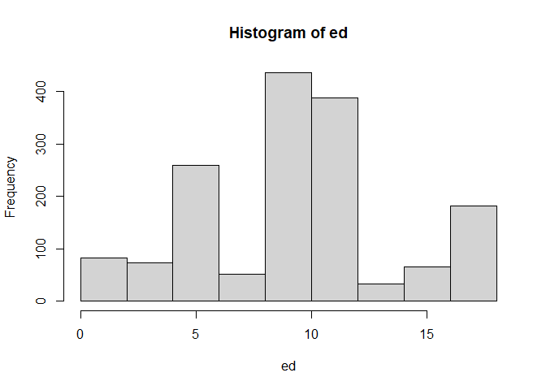

Práctica 2 - Manejo de datos
================
Ana Escoto
17/06/2021

# Previo

Si estás trabajando desde tu escritorio.

Vamos a llamar algunas librerías básicas, el tidyverse (que son muchas
librerías) y sjlabelled que nos sirve para el manejo de etiquetas

``` r
if (!require("pacman")) install.packages("pacman") # instala pacman si se requiere
```

    ## Loading required package: pacman

``` r
pacman::p_load(tidyverse, haven, sjlabelled, foreign, janitor) #carga los paquetes necesarios para esta práctica
```

# Importación de datos

## Desde Excel

El paquete más compatible con RStudio es readxl. A veces, otros paquetes
tienen más problemas de configuración entre R y el Java.

``` r
ICI_2018 <- readxl::read_excel("./datos/ICI_2018.xlsx", sheet = "para_importar")
```

    ## New names:
    ## * `` -> ...128
    ## * `` -> ...129
    ## * `` -> ...132
    ## * `PIB (Paridad de Poder Adquisitivo)` -> `PIB (Paridad de Poder Adquisitivo)...135`
    ## * `PIB (Paridad de Poder Adquisitivo)` -> `PIB (Paridad de Poder Adquisitivo)...136`
    ## * ...

``` r
#View(ICI_2018)
```

Como el nombre de paquete lo indica, sólo lee. Para escribir en este
formato, recomiendo el paquete “writexl”. Lo instalamos anteriormente.

Si quisiéramos exportar un objeto a Excel

``` r
writexl::write_xlsx(ICI_2018, path = "Mi_Exportación.xlsx")
```

## Desde STATA y SPSS

Si bien también se puede realizar desde el paquete foreign. Pero este no
importa algunas características como las etiquetas y tampoco funciona
con las versiones más nuevas de STATA. Vamos a instalar otro paquete,
compatible con el mundo tidyverse.

Recuerda que no hay que instalarlo (viene adentro de tidyverse). Se
instalasólo la primera vez. Una vez instalado un paquete, lo llamamos
con el comando “library”

``` r
lapop2019 <- haven::read_dta("./datos/lapop2019.dta")
```

!Importante, a R no le gustan los objetos con nombres que empiezan en
números

El paquete haven sí exporta información.

``` r
haven::write_dta(lapop2019, "./datos/mi_exportación.dta", version = 12)
```

Con SSPS es muy parecido. Dentro de “haven” hay una función específica
para ello.

``` r
encevi_hogar<- haven::read_sav("./datos/encevi_hogar.sav")
```

Para escribir

``` r
haven::write_sav(lapop2019 , "mi_exportacion.sav")
```

Checa que en todas las exportaciones en los nombres hay que incluir la
extensión del programa. Si quieres guardar en un lugar diferente al
directorio del trabajo, hay que escribir toda la ruta dentro de la
computadora.

## Revisión de nuestra base

Vamos a revisar la base, brevemente la base

``` r
class(lapop2019) # tipo de objeto
```

    ## [1] "tbl_df"     "tbl"        "data.frame"

``` r
names(lapop2019) # lista las variables
```

    ##   [1] "idnum"                  "uniq_id"                "cluster"               
    ##   [4] "upm"                    "wt"                     "wave"                  
    ##   [7] "pais"                   "nationality"            "estratopri"            
    ##  [10] "prov"                   "municipio"              "estratosec"            
    ##  [13] "tamano"                 "ur"                     "fecha"                 
    ##  [16] "q1"                     "q2"                     "a4"                    
    ##  [19] "soct2"                  "idio2"                  "np1"                   
    ##  [22] "cp6"                    "cp7"                    "cp8"                   
    ##  [25] "cp13"                   "cp20"                   "it1"                   
    ##  [28] "l1"                     "prot3"                  "jc10"                  
    ##  [31] "jc13"                   "jc15a"                  "jc16a"                 
    ##  [34] "vic1ext"                "vic1exta"               "vicbar7"               
    ##  [37] "vicbar7f"               "vicbar4a"               "mexsec1"               
    ##  [40] "mexsec2"                "mexsec3"                "mexsec4"               
    ##  [43] "aoj11"                  "aoj12"                  "b0"                    
    ##  [46] "b1"                     "b2"                     "b3"                    
    ##  [49] "b4"                     "b6"                     "b12"                   
    ##  [52] "b13"                    "b18"                    "b20"                   
    ##  [55] "b20a"                   "b21"                    "b21a"                  
    ##  [58] "b31"                    "b32"                    "b37"                   
    ##  [61] "b47a"                   "m1"                     "sd2new2"               
    ##  [64] "sd3new2"                "sd6new2"                "infrax"                
    ##  [67] "ros4"                   "redist1"                "redist2a"              
    ##  [70] "redist3"                "redist_questions_order" "ing4"                  
    ##  [73] "eff1"                   "eff2"                   "eff10"                 
    ##  [76] "eff11"                  "aoj22new"               "dst1b"                 
    ##  [79] "drk1"                   "env1c"                  "env1calt"              
    ##  [82] "env2b"                  "pn4"                    "dem30"                 
    ##  [85] "e5"                     "d1"                     "d2"                    
    ##  [88] "d3"                     "d4"                     "d5"                    
    ##  [91] "d6"                     "lib1"                   "lib2c"                 
    ##  [94] "exc2"                   "exc6"                   "exc20"                 
    ##  [97] "exc11"                  "exc13"                  "exc14"                 
    ## [100] "exc15"                  "exc16"                  "exc18"                 
    ## [103] "exc7"                   "exc7new"                "vb1"                   
    ## [106] "inf1"                   "vb2"                    "vb3n"                  
    ## [109] "vb10"                   "vb11"                   "pol1"                  
    ## [112] "vb20"                   "clien4a"                "clien1n"               
    ## [115] "clien1na"               "clien4b"                "vb50"                  
    ## [118] "vb51"                   "vb52"                   "vb58"                  
    ## [121] "w14a"                   "mil10a"                 "mil10e"                
    ## [124] "mexwf1_19"              "cct1b"                  "ed"                    
    ## [127] "q3cn"                   "q5a"                    "q5b"                   
    ## [130] "ocup4a"                 "ocupoit"                "ocup1a"                
    ## [133] "formal"                 "q10a"                   "q10new"                
    ## [136] "q14"                    "q14f"                   "q10cus"                
    ## [139] "q16"                    "q14h"                   "q14h2"                 
    ## [142] "q10d"                   "q10e"                   "fs2"                   
    ## [145] "fs8"                    "q11n"                   "q12c"                  
    ## [148] "q12bn"                  "etid"                   "gi0n"                  
    ## [151] "smedia1"                "smedia2"                "smedia3"               
    ## [154] "smedia4"                "smedia5"                "smedia6"               
    ## [157] "smedia7"                "smedia8"                "smedia9"               
    ## [160] "r3"                     "r4"                     "r4a"                   
    ## [163] "r5"                     "r6"                     "r7"                    
    ## [166] "r8"                     "r12"                    "r14"                   
    ## [169] "r15"                    "r18"                    "r1"                    
    ## [172] "r16"                    "psc1"                   "psc2"                  
    ## [175] "psc7"                   "psc8"                   "psc9"                  
    ## [178] "psc10"                  "psc11"                  "psc11a"                
    ## [181] "psc12"                  "psc13_1"                "psc13_2"               
    ## [184] "psc13_3"                "psc13_4"                "psc13_5"               
    ## [187] "psc13_6"                "psc13_7"                "psc13_8"               
    ## [190] "psc13_9"                "psc13_10"               "psc13_11"              
    ## [193] "psc13_12"               "psc13_13"               "psc3_0"                
    ## [196] "psc3_1"                 "psc3_2"                 "psc3_3"                
    ## [199] "psc4"                   "psc5"                   "psc6"                  
    ## [202] "inteval"                "noise1"                 "noise2_1"              
    ## [205] "noise2_2"               "noise2_3"               "noise2_4"              
    ## [208] "noise2_5"               "noise2_6"               "noise2_7"              
    ## [211] "noise2_8"               "noise2_9"               "noise2_10"             
    ## [214] "conocim"                "sex"                    "formatq"               
    ## [217] "colorr"                 "sexi"                   "colori"                
    ## [220] "intid"                  "idiomaq"

``` r
head(lapop2019) # muestra las primeras 6 líneas
```

    ## # A tibble: 6 x 221
    ##   idnum       uniq_id cluster    upm    wt  wave    pais nationality  estratopri
    ##   <dbl>     <dbl+lbl>   <dbl> <dbl+> <dbl> <dbl> <dbl+l>   <dbl+lbl>   <dbl+lbl>
    ## 1   707 1.80e7 [MEX1~     781    129     1  2018 1 [Méx~ 1 [Mexican~ 102 [Centr~
    ## 2  1384 1.80e7 [MEX1~     661     72     1  2018 1 [Méx~ 1 [Mexican~ 103 [Centr~
    ## 3   752 1.80e7 [MEX1~     661     72     1  2018 1 [Méx~ 1 [Mexican~ 103 [Centr~
    ## 4   777 1.80e7 [MEX1~     662     72     1  2018 1 [Méx~ 1 [Mexican~ 103 [Centr~
    ## 5   957 1.80e7 [MEX1~     491    128     1  2018 1 [Méx~ 1 [Mexican~ 102 [Centr~
    ## 6   495 1.80e7 [MEX1~     731     66     1  2018 1 [Méx~ 1 [Mexican~ 102 [Centr~
    ## # ... with 212 more variables: prov <dbl+lbl>, municipio <dbl+lbl>,
    ## #   estratosec <dbl+lbl>, tamano <dbl+lbl>, ur <dbl+lbl>, fecha <date>,
    ## #   q1 <dbl+lbl>, q2 <dbl+lbl>, a4 <dbl+lbl>, soct2 <dbl+lbl>, idio2 <dbl+lbl>,
    ## #   np1 <dbl+lbl>, cp6 <dbl+lbl>, cp7 <dbl+lbl>, cp8 <dbl+lbl>, cp13 <dbl+lbl>,
    ## #   cp20 <dbl+lbl>, it1 <dbl+lbl>, l1 <dbl+lbl>, prot3 <dbl+lbl>,
    ## #   jc10 <dbl+lbl>, jc13 <dbl+lbl>, jc15a <dbl+lbl>, jc16a <dbl+lbl>,
    ## #   vic1ext <dbl+lbl>, vic1exta <dbl+lbl>, vicbar7 <dbl+lbl>,
    ## #   vicbar7f <dbl+lbl>, vicbar4a <dbl+lbl>, mexsec1 <dbl+lbl>,
    ## #   mexsec2 <dbl+lbl>, mexsec3 <dbl+lbl>, mexsec4 <dbl+lbl>, aoj11 <dbl+lbl>,
    ## #   aoj12 <dbl+lbl>, b0 <dbl+lbl>, b1 <dbl+lbl>, b2 <dbl+lbl>, b3 <dbl+lbl>,
    ## #   b4 <dbl+lbl>, b6 <dbl+lbl>, b12 <dbl+lbl>, b13 <dbl+lbl>, b18 <dbl+lbl>,
    ## #   b20 <dbl+lbl>, b20a <dbl+lbl>, b21 <dbl+lbl>, b21a <dbl+lbl>,
    ## #   b31 <dbl+lbl>, b32 <dbl+lbl>, b37 <dbl+lbl>, b47a <dbl+lbl>, m1 <dbl+lbl>,
    ## #   sd2new2 <dbl+lbl>, sd3new2 <dbl+lbl>, sd6new2 <dbl+lbl>, infrax <dbl+lbl>,
    ## #   ros4 <dbl+lbl>, redist1 <dbl+lbl>, redist2a <dbl+lbl>, redist3 <dbl+lbl>,
    ## #   redist_questions_order <chr>, ing4 <dbl+lbl>, eff1 <dbl+lbl>,
    ## #   eff2 <dbl+lbl>, eff10 <dbl+lbl>, eff11 <dbl+lbl>, aoj22new <dbl+lbl>,
    ## #   dst1b <dbl+lbl>, drk1 <dbl+lbl>, env1c <dbl+lbl>, env1calt <dbl+lbl>,
    ## #   env2b <dbl+lbl>, pn4 <dbl+lbl>, dem30 <dbl+lbl>, e5 <dbl+lbl>,
    ## #   d1 <dbl+lbl>, d2 <dbl+lbl>, d3 <dbl+lbl>, d4 <dbl+lbl>, d5 <dbl+lbl>,
    ## #   d6 <dbl+lbl>, lib1 <dbl+lbl>, lib2c <dbl+lbl>, exc2 <dbl+lbl>,
    ## #   exc6 <dbl+lbl>, exc20 <dbl+lbl>, exc11 <dbl+lbl>, exc13 <dbl+lbl>,
    ## #   exc14 <dbl+lbl>, exc15 <dbl+lbl>, exc16 <dbl+lbl>, exc18 <dbl+lbl>,
    ## #   exc7 <dbl+lbl>, exc7new <dbl+lbl>, vb1 <dbl+lbl>, inf1 <dbl+lbl>,
    ## #   vb2 <dbl+lbl>, vb3n <dbl+lbl>, vb10 <dbl+lbl>, ...

``` r
table(lapop2019$soct2) # un tabulado simple
```

    ## 
    ##   1   2   3 
    ## 364 718 455

## Revisión con dplyr

Operador de “pipe” o “tubería” %&gt;% (Ctrl+Shift+M) Antes de continuar,
presentemos el operador “pipe” %&gt;%. dplyr importa este operador de
otro paquete (magrittr). Este operador le permite canalizar la salida de
una función a la entrada de otra función. En lugar de funciones de
anidamiento (lectura desde adentro hacia afuera), la idea de la tubería
es leer las funciones de izquierda a derecha.

``` r
lapop2019 %>% 
    dplyr::select(q1, q2) %>% 
    head
```

    ## # A tibble: 6 x 2
    ##           q1        q2
    ##    <dbl+lbl> <dbl+lbl>
    ## 1 1 [Hombre]        23
    ## 2 1 [Hombre]        36
    ## 3 2 [Mujer]         46
    ## 4 1 [Hombre]        64
    ## 5 2 [Mujer]         20
    ## 6 2 [Mujer]         23

``` r
lapop2019 %>% 
    dplyr::select(q1, q2) %>% 
    glimpse
```

    ## Rows: 1,580
    ## Columns: 2
    ## $ q1 <dbl+lbl> 1, 1, 2, 1, 2, 2, 2, 2, 2, 2, 2, 1, 2, 2, 2, 1, 2, 1, 1, 1, 1, ~
    ## $ q2 <dbl+lbl> 23, 36, 46, 64, 20, 23, 36, 30, 65, 34, 52, 57, 38, 20, 48, 52,~

## Etiquetas importadas y cómo usarlas

Podemos ver que los objetos “data.frame”(*spoiler*, ya hablaremos de
ellos), tiene una clase que se llama “haven\_labelled”

``` r
class(lapop2019$q1)
```

    ## [1] "haven_labelled" "vctrs_vctr"     "double"

¿Esto que significa? Que en el programa original hay alguna etiqueta que
podemos usar.

``` r
table(lapop2019$q1)
```

    ## 
    ##   1   2 
    ## 775 805

``` r
table(sjlabelled::as_label(lapop2019$q1))
```

    ## 
    ## Hombre  Mujer 
    ##    775    805

## Leer desde archivos de texto y desde una url

Desde el portal <https://datos.gob.mx/> tenemos acceso a directo a
varias fuentes de información, al ser datos abiertos, los archivos de
texto son muy comunes.

Leeremos parte de esa información, específicamente la de CONAPO
<https://datos.gob.mx/busca/dataset/proyecciones-de-la-poblacion-de-mexico-y-de-las-entidades-federativas-2016-2050>

En estas bases hay acentos y otros carecteres especiales del español,
por lo que agregaremos una opción de “encoding”, de lo contrario da
error.

``` r
mig_inter_quin_proyecciones <- read.csv("http://www.conapo.gob.mx/work/models/CONAPO/Datos_Abiertos/Proyecciones2018/mig_inter_quin_proyecciones.csv", encoding="latin1")
#View(mig_inter_quin_proyecciones)
names(mig_inter_quin_proyecciones)
```

    ## [1] "RENGLON"     "AÑO"         "ENTIDAD"     "CVE_GEO"     "EDAD"       
    ## [6] "SEXO"        "EMIGRANTES"  "INMIGRANTES"

# Revisando LAPOP 2019

## Ojeando

``` r
dplyr::glimpse(lapop2019)
```

    ## Rows: 1,580
    ## Columns: 221
    ## $ idnum                  <dbl> 707, 1384, 752, 777, 957, 495, 1278, 1012, 1084~
    ## $ uniq_id                <dbl+lbl> 18010707, 18011384, 18010752, 18010777, 180~
    ## $ cluster                <dbl> 781, 661, 661, 662, 491, 731, 752, 782, 91, 81,~
    ## $ upm                    <dbl+lbl> 129,  72,  72,  72, 128,  66,  64, 129,  92~
    ## $ wt                     <dbl> 1, 1, 1, 1, 1, 1, 1, 1, 1, 1, 1, 1, 1, 1, 1, 1,~
    ## $ wave                   <dbl> 2018, 2018, 2018, 2018, 2018, 2018, 2018, 2018,~
    ## $ pais                   <dbl+lbl> 1, 1, 1, 1, 1, 1, 1, 1, 1, 1, 1, 1, 1, 1, 1~
    ## $ nationality            <dbl+lbl> 1, 1, 1, 1, 1, 1, 1, 1, 1, 1, 1, 1, 1, 1, 1~
    ## $ estratopri             <dbl+lbl> 102, 103, 103, 103, 102, 102, 102, 102, 101~
    ## $ prov                   <dbl+lbl> 116, 115, 115, 115, 114, 116, 116, 116, 105~
    ## $ municipio              <dbl+lbl> 116113, 115061, 115061, 115061, 114023, 116~
    ## $ estratosec             <dbl+lbl> 1, 1, 1, 1, 1, 1, 1, 1, 1, 2, 3, 3, 2, 1, 1~
    ## $ tamano                 <dbl+lbl> 2, 1, 1, 1, 3, 2, 2, 2, 2, 4, 4, 4, 3, 2, 2~
    ## $ ur                     <dbl+lbl> 2, 1, 1, 1, 1, 1, 1, 2, 1, 1, 1, 1, 1, 1, 1~
    ## $ fecha                  <date> 2019-02-03, 2019-01-30, 2019-01-30, 2019-01-30~
    ## $ q1                     <dbl+lbl> 1, 1, 2, 1, 2, 2, 2, 2, 2, 2, 2, 1, 2, 2, 2~
    ## $ q2                     <dbl+lbl> 23, 36, 46, 64, 20, 23, 36, 30, 65, 34, 52,~
    ## $ a4                     <dbl+lbl>  1, 70, 70, 70, 57, 31, 70, 70, 27,  5, 27,~
    ## $ soct2                  <dbl+lbl> 3, 3, 1, 1, 2, 3, 3, 2, 3, 2, 3, 2, 3, 2, 1~
    ## $ idio2                  <dbl+lbl> 3, 2, 1, 3, 2, 2, 3, 2, 3, 2, 3, 2, 3, 2, 2~
    ## $ np1                    <dbl+lbl> 2, 2, 2, 2, 2, 2, 2, 2, 2, 1, 2, 1, 2, 2, 2~
    ## $ cp6                    <dbl+lbl>     4,     4,     1,     2,     4,     4,  ~
    ## $ cp7                    <dbl+lbl> 4, 4, 4, 4, 4, 4, 2, 4, 4, 2, 4, 2, 2, 2, 2~
    ## $ cp8                    <dbl+lbl> 4, 4, 4, 3, 4, 4, 4, 4, 4, 4, 4, 2, 2, 4, 4~
    ## $ cp13                   <dbl+lbl> 4, 4, 4, 4, 4, 4, 4, 4, 4, 4, 4, 2, 4, 4, 4~
    ## $ cp20                   <dbl+lbl> NA(c), NA(c),     4, NA(c),     4,     4,  ~
    ## $ it1                    <dbl+lbl>     3,     3,     3,     2,     3,     3,  ~
    ## $ l1                     <dbl+lbl>     4,     5,     1,     9,     6,     3,  ~
    ## $ prot3                  <dbl+lbl>     2,     2,     2,     2,     2,     2,  ~
    ## $ jc10                   <dbl+lbl> NA(c),     2, NA(a), NA(c),     1,     2, N~
    ## $ jc13                   <dbl+lbl>     1, NA(c), NA(c),     2, NA(c), NA(c),  ~
    ## $ jc15a                  <dbl+lbl>     1,     2, NA(a),     1,     2,     2, N~
    ## $ jc16a                  <dbl+lbl>     2,     2,     1,     1,     2,     2,  ~
    ## $ vic1ext                <dbl+lbl> 2, 2, 2, 2, 2, 2, 1, 2, 2, 2, 1, 1, 2, 2, 1~
    ## $ vic1exta               <dbl+lbl> NA(c), NA(c), NA(c), NA(c), NA(c), NA(c),  ~
    ## $ vicbar7                <dbl+lbl> 2, 1, 2, 1, 2, 2, 2, 1, 2, 2, 2, 2, 1, 2, 2~
    ## $ vicbar7f               <dbl+lbl> NA(c),     3, NA(c),     1, NA(c), NA(c), N~
    ## $ vicbar4a               <dbl+lbl> 0, 0, 0, 0, 1, 0, 1, 0, 0, 0, 1, 0, 0, 0, 0~
    ## $ mexsec1                <dbl+lbl> 1, 1, 1, 1, 1, 1, 1, 1, 1, 1, 1, 1, 1, 1, 1~
    ## $ mexsec2                <dbl+lbl>     2,     1,     2,     1,     1,     1,  ~
    ## $ mexsec3                <dbl+lbl>     6,     6,     5,     6,     2,     6,  ~
    ## $ mexsec4                <dbl+lbl> 2, 2, 2, 2, 2, 2, 2, 2, 2, 2, 2, 2, 1, 2, 1~
    ## $ aoj11                  <dbl+lbl> 2, 1, 4, 3, 3, 3, 4, 4, 2, 1, 3, 4, 2, 3, 4~
    ## $ aoj12                  <dbl+lbl> 4, 4, 4, 2, 3, 2, 4, 4, 3, 2, 3, 4, 4, 4, 4~
    ## $ b0                     <dbl+lbl> 5, 4, 5, 3, 2, 5, 2, 4, 6, 4, 4, 5, 7, 4, 3~
    ## $ b1                     <dbl+lbl> 4, 3, 1, 4, 2, 2, 2, 5, 5, 4, 4, 3, 1, 5, 1~
    ## $ b2                     <dbl+lbl> 1, 7, 1, 7, 6, 5, 4, 3, 7, 4, 6, 5, 3, 7, 1~
    ## $ b3                     <dbl+lbl> 2, 3, 1, 6, 2, 5, 1, 2, 5, 4, 4, 4, 1, 3, 1~
    ## $ b4                     <dbl+lbl> 1, 5, 1, 7, 4, 5, 3, 1, 5, 4, 3, 5, 1, 4, 1~
    ## $ b6                     <dbl+lbl> 7, 5, 1, 7, 7, 7, 4, 4, 7, 5, 3, 6, 1, 4, 1~
    ## $ b12                    <dbl+lbl> 5, 5, 3, 7, 5, 6, 4, 1, 5, 6, 6, 7, 2, 4, 1~
    ## $ b13                    <dbl+lbl>     4,     4, NA(a),     7,     4,     5,  ~
    ## $ b18                    <dbl+lbl> 2, 3, 1, 5, 4, 5, 3, 1, 5, 6, 2, 3, 1, 4, 1~
    ## $ b20                    <dbl+lbl> 7, 3, 1, 7, 5, 7, 4, 5, 5, 5, 7, 6, 4, 6, 1~
    ## $ b20a                   <dbl+lbl>     1,     1,     1,     1,     3,     5,  ~
    ## $ b21                    <dbl+lbl> 1, 1, 1, 5, 5, 4, 1, 4, 5, 5, 3, 3, 2, 2, 1~
    ## $ b21a                   <dbl+lbl> 1, 7, 7, 7, 4, 4, 2, 7, 6, 5, 3, 5, 5, 4, 7~
    ## $ b31                    <dbl+lbl>     2,     6,     1,     6,     4,     4,  ~
    ## $ b32                    <dbl+lbl>     2,     5,     1,     5,     5,     5,  ~
    ## $ b37                    <dbl+lbl> 4, 2, 5, 6, 6, 5, 3, 1, 6, 7, 5, 4, 3, 4, 1~
    ## $ b47a                   <dbl+lbl> 2, 1, 7, 7, 5, 4, 1, 1, 5, 6, 2, 3, 1, 4, 1~
    ## $ m1                     <dbl+lbl>     2,     1,     2,     1,     2,     2,  ~
    ## $ sd2new2                <dbl+lbl> 2, 3, 4, 4, 2, 2, 2, 3, 2, 2, 2, 3, 2, 3, 4~
    ## $ sd3new2                <dbl+lbl>     3,     3,     3,     4,     2,     4,  ~
    ## $ sd6new2                <dbl+lbl> 2, 2, 4, 2, 2, 3, 4, 3, 3, 2, 3, 3, 2, 2, 3~
    ## $ infrax                 <dbl+lbl>     2,     4,     6,     5,     2,     5,  ~
    ## $ ros4                   <dbl+lbl> 3, 7, 1, 5, 5, 3, 4, 7, 6, 6, 6, 4, 4, 4, 7~
    ## $ redist1                <dbl+lbl> 6, 5, 1, 6, 7, 5, 3, 3, 7, 6, 7, 7, 7, 4, 7~
    ## $ redist2a               <dbl+lbl> 5, 7, 1, 6, 4, 4, 4, 5, 5, 6, 1, 7, 7, 1, 7~
    ## $ redist3                <dbl+lbl> 3, 4, 1, 6, 7, 4, 3, 4, 7, 6, 7, 2, 7, 3, 7~
    ## $ redist_questions_order <chr> "redist2a redist3 redist1", "redist1 redist2a r~
    ## $ ing4                   <dbl+lbl>     5,     4,     1,     4,     5,     5,  ~
    ## $ eff1                   <dbl+lbl> 5, 7, 1, 5, 4, 5, 4, 6, 6, 4, 7, 6, 6, 3, 1~
    ## $ eff2                   <dbl+lbl> 3, 5, 7, 3, 5, 5, 4, 4, 5, 3, 6, 5, 5, 4, 7~
    ## $ eff10                  <dbl+lbl> 5, 5, 6, 3, 4, 5, 3, 5, 6, 5, 5, 1, 5, 4, 7~
    ## $ eff11                  <dbl+lbl> 6, 4, 4, 5, 4, 3, 4, 3, 6, 5, 6, 3, 7, 5, 1~
    ## $ aoj22new               <dbl+lbl> 6, 4, 1, 7, 6, 6, 7, 6, 6, 5, 7, 7, 7, 3, 7~
    ## $ dst1b                  <dbl+lbl> 7, 7, 1, 5, 7, 6, 5, 2, 7, 6, 6, 6, 6, 4, 7~
    ## $ drk1                   <dbl+lbl> 3, 1, 3, 3, 3, 2, 4, 4, 3, 3, 2, 4, 2, 2, 4~
    ## $ env1c                  <dbl+lbl> 1, 7, 1, 7, 1, 4, 3, 7, 7, 6, 4, 1, 1, 7, 7~
    ## $ env1calt               <dbl+lbl>     2,     1,     2,     1,     2,     1,  ~
    ## $ env2b                  <dbl+lbl> 1, 1, 1, 1, 1, 1, 3, 1, 1, 1, 1, 1, 1, 3, 1~
    ## $ pn4                    <dbl+lbl> 4, 3, 4, 3, 2, 2, 3, 1, 3, 3, 3, 3, 2, 2, 2~
    ## $ dem30                  <dbl+lbl>     1,     2, NA(a),     1,     1,     2,  ~
    ## $ e5                     <dbl+lbl> 4, 4, 4, 9, 5, 6, 2, 9, 5, 4, 6, 6, 6, 5, 1~
    ## $ d1                     <dbl+lbl>     3,     5,     8,     2,     8,     4,  ~
    ## $ d2                     <dbl+lbl>  2,  2, 10,  5,  7,  6,  4, 10,  6,  4,  9,~
    ## $ d3                     <dbl+lbl> 2, 1, 1, 7, 4, 3, 5, 8, 8, 6, 7, 3, 7, 6, 1~
    ## $ d4                     <dbl+lbl> 3, 2, 1, 3, 3, 3, 5, 6, 8, 6, 5, 3, 6, 5, 1~
    ## $ d5                     <dbl+lbl>  5,  5, 10,  2,  5,  7,  6,  9,  2,  7,  9,~
    ## $ d6                     <dbl+lbl>     5,     8,    10,     1,     4,     9,  ~
    ## $ lib1                   <dbl+lbl> 3, 2, 1, 2, 2, 3, 2, 3, 1, 2, 2, 1, 2, 2, 1~
    ## $ lib2c                  <dbl+lbl> 1, 1, 1, 3, 1, 2, 3, 3, 1, 2, 1, 1, 1, 1, 1~
    ## $ exc2                   <dbl+lbl> 1, 0, 1, 0, 0, 1, 0, 0, 0, 0, 0, 0, 0, 0, 0~
    ## $ exc6                   <dbl+lbl> 0, 0, 1, 0, 0, 1, 0, 0, 0, 0, 0, 0, 0, 0, 0~
    ## $ exc20                  <dbl+lbl> 0, 0, 1, 0, 0, 1, 0, 0, 0, 0, 0, 0, 0, 0, 0~
    ## $ exc11                  <dbl+lbl>     0, NA(c), NA(c), NA(c), NA(c),     1, N~
    ## $ exc13                  <dbl+lbl>     0,     0,     0, NA(c), NA(c), NA(c), N~
    ## $ exc14                  <dbl+lbl> NA(c), NA(c),     0, NA(c), NA(c), NA(c), N~
    ## $ exc15                  <dbl+lbl> NA(c), NA(c),     0,     0, NA(c),     0,  ~
    ## $ exc16                  <dbl+lbl> NA(c),     0, NA(c), NA(c), NA(c), NA(c),  ~
    ## $ exc18                  <dbl+lbl> 1, 0, 0, 0, 0, 0, 0, 0, 0, 0, 0, 0, 1, 0, 0~
    ## $ exc7                   <dbl+lbl>     3, NA(c), NA(c), NA(c),     1, NA(c), N~
    ## $ exc7new                <dbl+lbl> NA(c),     5,     5,     4, NA(c),     2,  ~
    ## $ vb1                    <dbl+lbl> 1, 2, 1, 1, 1, 1, 2, 2, 1, 1, 1, 1, 1, 2, 1~
    ## $ inf1                   <dbl+lbl> 1, 1, 1, 1, 1, 1, 1, 1, 1, 1, 1, 1, 1, 1, 1~
    ## $ vb2                    <dbl+lbl> 2, 1, 1, 1, 1, 2, 2, 2, 1, 1, 1, 1, 1, 1, 1~
    ## $ vb3n                   <dbl+lbl> NA(c),   101,   101,   101,   101, NA(c), N~
    ## $ vb10                   <dbl+lbl> 2, 2, 1, 2, 2, 2, 2, 2, 2, 2, 1, 1, 2, 2, 1~
    ## $ vb11                   <dbl+lbl> NA(c), NA(c),   109, NA(c), NA(c), NA(c), N~
    ## $ pol1                   <dbl+lbl> 2, 1, 1, 3, 1, 3, 4, 4, 4, 2, 4, 1, 3, 4, 4~
    ## $ vb20                   <dbl+lbl>     4,     2,     2,     2,     3,     3,  ~
    ## $ clien4a                <dbl+lbl>     4, NA(c),     4,     3,     3, NA(c), N~
    ## $ clien1n                <dbl+lbl> 2, 2, 1, 2, 2, 2, 2, 2, 2, 1, 2, 1, 2, 2, 2~
    ## $ clien1na               <dbl+lbl> 2, 2, 1, 2, 2, 1, 2, 2, 2, 1, 2, 2, 2, 2, 2~
    ## $ clien4b                <dbl+lbl> NA(c),     5, NA(c), NA(c), NA(c),     4,  ~
    ## $ vb50                   <dbl+lbl> 3, 4, 2, 3, 2, 3, 2, 3, 2, 3, 3, 3, 3, 3, 3~
    ## $ vb51                   <dbl+lbl> NA(c), NA(c),     2, NA(c),     3, NA(c), N~
    ## $ vb52                   <dbl+lbl> NA(c), NA(c),     1, NA(c),     2, NA(c), N~
    ## $ vb58                   <dbl+lbl> 2, 4, 4, 1, 2, 3, 2, 3, 2, 1, 3, 3, 3, 2, 1~
    ## $ w14a                   <dbl+lbl>     2,     2,     2,     1,     1,     1,  ~
    ## $ mil10a                 <dbl+lbl> NA(a), NA(a), NA(c), NA(a), NA(c),     3, N~
    ## $ mil10e                 <dbl+lbl>     3, NA(a), NA(c),     4, NA(c), NA(b), N~
    ## $ mexwf1_19              <dbl+lbl> 2, 2, 2, 2, 2, 1, 2, 2, 2, 2, 2, 2, 2, 2, 2~
    ## $ cct1b                  <dbl+lbl> 2, 2, 2, 2, 2, 1, 1, 2, 2, 2, 2, 2, 1, 2, 2~
    ## $ ed                     <dbl+lbl>  9, 18,  8,  6, 12, 12, 12, 15,  8, 13,  9,~
    ## $ q3cn                   <dbl+lbl>     1,     4,     2,     1,     1,     1,  ~
    ## $ q5a                    <dbl+lbl> 3, 5, 2, 3, 2, 4, 2, 2, 3, 4, 2, 3, 3, 2, 5~
    ## $ q5b                    <dbl+lbl>     1,     3,     2,     2,     1,     1,  ~
    ## $ ocup4a                 <dbl+lbl> 1, 1, 5, 3, 4, 5, 5, 4, 5, 5, 1, 3, 5, 4, 5~
    ## $ ocupoit                <dbl+lbl>     5,     4, NA(c), NA(c), NA(c), NA(c), N~
    ## $ ocup1a                 <dbl+lbl> NA(a), NA(a), NA(c), NA(c), NA(c), NA(c), N~
    ## $ formal                 <dbl+lbl>     2,     1, NA(c), NA(c), NA(c), NA(c), N~
    ## $ q10a                   <dbl+lbl> 2, 2, 2, 2, 2, 2, 2, 2, 2, 2, 2, 2, 2, 2, 2~
    ## $ q10new                 <dbl+lbl>    12,     4,     1,     6, NA(a),     3,  ~
    ## $ q14                    <dbl+lbl> 2, 2, 2, 2, 2, 2, 2, 2, 2, 1, 2, 1, 2, 2, 1~
    ## $ q14f                   <dbl+lbl> NA(c), NA(c), NA(c), NA(c), NA(c), NA(c), N~
    ## $ q10cus                 <dbl+lbl> 1, 2, 2, 2, 2, 1, 1, 2, 2, 2, 1, 1, 1, 2, 1~
    ## $ q16                    <dbl+lbl>     2, NA(c), NA(c), NA(c), NA(c),     3,  ~
    ## $ q14h                   <dbl+lbl> 2, 2, 2, 2, 2, 2, 2, 2, 2, 2, 2, 2, 2, 2, 2~
    ## $ q14h2                  <dbl+lbl> NA(c), NA(c), NA(c), NA(c), NA(c), NA(c), N~
    ## $ q10d                   <dbl+lbl> 2, 2, 4, 4, 2, 2, 3, 2, 3, 2, 2, 3, 2, 2, 3~
    ## $ q10e                   <dbl+lbl> 3, 2, 3, 3, 2, 2, 3, 2, 2, 2, 2, 3, 3, 2, 2~
    ## $ fs2                    <dbl+lbl> 0, 0, 0, 0, 0, 0, 1, 0, 0, 0, 0, 1, 0, 0, 0~
    ## $ fs8                    <dbl+lbl> 0, 0, 1, 0, 0, 0, 1, 0, 0, 0, 0, 1, 0, 0, 0~
    ## $ q11n                   <dbl+lbl> 2, 2, 1, 2, 1, 2, 2, 1, 6, 2, 2, 2, 3, 1, 2~
    ## $ q12c                   <dbl+lbl>     3,     4,     5,     2,     8,     3,  ~
    ## $ q12bn                  <dbl+lbl>     1,     2,     2,     0,     0,     1,  ~
    ## $ etid                   <dbl+lbl>     7,     7,     2,     2,     1,     2, N~
    ## $ gi0n                   <dbl+lbl> 2, 1, 1, 1, 2, 1, 2, 2, 1, 3, 1, 2, 1, 2, 5~
    ## $ smedia1                <dbl+lbl> 2, 2, 2, 2, 1, 1, 2, 2, 1, 2, 2, 2, 2, 2, 2~
    ## $ smedia2                <dbl+lbl> NA(c), NA(c), NA(c), NA(c),     1,     2, N~
    ## $ smedia3                <dbl+lbl> NA(c), NA(c), NA(c), NA(c),     2,     2, N~
    ## $ smedia4                <dbl+lbl> 2, 2, 2, 2, 2, 2, 2, 2, 2, 2, 2, 2, 2, 2, 2~
    ## $ smedia5                <dbl+lbl> NA(c), NA(c), NA(c), NA(c), NA(c), NA(c), N~
    ## $ smedia6                <dbl+lbl> NA(c), NA(c), NA(c), NA(c), NA(c), NA(c), N~
    ## $ smedia7                <dbl+lbl> 1, 2, 2, 2, 2, 1, 1, 2, 1, 2, 2, 2, 2, 2, 2~
    ## $ smedia8                <dbl+lbl>     1, NA(c), NA(c), NA(c), NA(c),     2,  ~
    ## $ smedia9                <dbl+lbl>     2, NA(c), NA(c), NA(c), NA(c),     5,  ~
    ## $ r3                     <dbl+lbl> 1, 1, 0, 1, 1, 1, 1, 1, 1, 1, 1, 1, 0, 1, 1~
    ## $ r4                     <dbl+lbl> 0, 1, 0, 0, 1, 0, 0, 0, 1, 1, 0, 0, 0, 0, 1~
    ## $ r4a                    <dbl+lbl> 1, 0, 0, 1, 1, 1, 0, 0, 1, 0, 0, 0, 0, 1, 1~
    ## $ r5                     <dbl+lbl> 1, 0, 0, 0, 0, 3, 0, 0, 1, 1, 0, 0, 0, 0, 0~
    ## $ r6                     <dbl+lbl> 0, 0, 0, 1, 1, 0, 1, 0, 1, 1, 1, 1, 0, 1, 1~
    ## $ r7                     <dbl+lbl> 1, 1, 0, 0, 0, 0, 0, 0, 1, 0, 0, 0, 0, 0, 0~
    ## $ r8                     <dbl+lbl> 1, 0, 0, 0, 0, 0, 0, 0, 0, 0, 0, 0, 0, 0, 0~
    ## $ r12                    <dbl+lbl> 1, 1, 1, 1, 1, 1, 1, 1, 1, 1, 1, 1, 1, 1, 1~
    ## $ r14                    <dbl+lbl> 1, 1, 0, 0, 1, 1, 0, 1, 1, 1, 1, 1, 0, 1, 1~
    ## $ r15                    <dbl+lbl> 0, 0, 0, 0, 0, 0, 1, 0, 0, 0, 0, 0, 0, 0, 0~
    ## $ r18                    <dbl+lbl> 1, 0, 0, 0, 1, 0, 1, 0, 1, 1, 0, 0, 0, 0, 1~
    ## $ r1                     <dbl+lbl> 1, 1, 1, 1, 0, 1, 1, 1, 1, 1, 1, 0, 1, 1, 1~
    ## $ r16                    <dbl+lbl>     1,     0,     0,     0, NA(c),     1,  ~
    ## $ psc1                   <dbl+lbl> 11,  1, 11,  1, 11,  7, 11, 11, 11,  1, 11,~
    ## $ psc2                   <dbl+lbl> 1, 1, 1, 1, 1, 7, 2, 1, 1, 1, 1, 1, 2, 1, 1~
    ## $ psc7                   <dbl+lbl>     7,     7,     3,     3,     7, NA(c),  ~
    ## $ psc8                   <dbl+lbl>     3,    24,     6,     4,    24, NA(c),  ~
    ## $ psc9                   <dbl+lbl>     1,     0,     4,     3,     0, NA(c),  ~
    ## $ psc10                  <dbl+lbl>     1,     0,     0,     0,     0, NA(c),  ~
    ## $ psc11                  <dbl+lbl> 1, 1, 1, 1, 7, 2, 1, 1, 1, 1, 1, 1, 2, 1, 1~
    ## $ psc11a                 <dbl+lbl> NA(c), NA(c), NA(c), NA(c), NA(c), NA(c), N~
    ## $ psc12                  <dbl+lbl> 2, 2, 2, 2, 2, 1, 2, 2, 2, 2, 2, 2, 1, 2, 2~
    ## $ psc13_1                <dbl+lbl> 1, 1, 1, 1, 1, 1, 1, 1, 1, 1, 1, 1, 1, 1, 1~
    ## $ psc13_2                <dbl+lbl> 0, 0, 0, 0, 0, 0, 0, 0, 0, 0, 0, 0, 0, 0, 1~
    ## $ psc13_3                <dbl+lbl> 0, 0, 0, 0, 0, 0, 0, 0, 0, 0, 0, 0, 0, 0, 0~
    ## $ psc13_4                <dbl+lbl> 0, 0, 0, 0, 0, 0, 0, 0, 0, 0, 0, 0, 0, 0, 0~
    ## $ psc13_5                <dbl+lbl> 0, 0, 0, 0, 1, 0, 0, 0, 0, 0, 0, 0, 0, 0, 0~
    ## $ psc13_6                <dbl+lbl> 0, 0, 0, 0, 0, 0, 0, 0, 0, 0, 0, 0, 0, 0, 0~
    ## $ psc13_7                <dbl+lbl> 0, 0, 0, 0, 0, 0, 0, 0, 0, 0, 0, 0, 0, 0, 0~
    ## $ psc13_8                <dbl+lbl> 0, 0, 0, 0, 0, 0, 0, 0, 0, 0, 0, 0, 0, 0, 0~
    ## $ psc13_9                <dbl+lbl> 0, 0, 0, 0, 0, 0, 0, 0, 0, 0, 0, 0, 0, 0, 0~
    ## $ psc13_10               <dbl+lbl> 0, 0, 0, 0, 0, 0, 0, 0, 0, 0, 0, 0, 0, 0, 0~
    ## $ psc13_11               <dbl+lbl> 0, 0, 0, 0, 0, 0, 0, 0, 0, 0, 0, 0, 0, 0, 0~
    ## $ psc13_12               <dbl+lbl> 0, 0, 0, 0, 0, 0, 0, 0, 0, 0, 0, 0, 0, 0, 0~
    ## $ psc13_13               <dbl+lbl> 0, 0, 0, 0, 0, 0, 0, 0, 0, 0, 0, 0, 0, 0, 0~
    ## $ psc3_0                 <dbl+lbl>     0,     0,     0,     0,     1,     0,  ~
    ## $ psc3_1                 <dbl+lbl>     1,     0,     0,     0,     0,     1,  ~
    ## $ psc3_2                 <dbl+lbl>     0,     1,     1,     1,     0,     0,  ~
    ## $ psc3_3                 <dbl+lbl>     0,     0,     0,     0,     0,     0,  ~
    ## $ psc4                   <dbl+lbl>     6,     1,     2,     5,     6,     6,  ~
    ## $ psc5                   <dbl+lbl>     4,     4,     4,     5,     6,     4,  ~
    ## $ psc6                   <dbl+lbl>     6,     5,     6,     5,     6,     6,  ~
    ## $ inteval                <dbl+lbl>  5,  9, 10, 10,  8,  9,  3,  9,  9,  7,  9,~
    ## $ noise1                 <dbl+lbl> 2, 2, 0, 1, 1, 1, 2, 2, 0, 1, 1, 2, 2, 2, 0~
    ## $ noise2_1               <dbl+lbl> NA(a),     0, NA(c),     1, NA(a),     0,  ~
    ## $ noise2_2               <dbl+lbl> NA(a),     1, NA(c),     1, NA(a),     1,  ~
    ## $ noise2_3               <dbl+lbl> NA(a),     0, NA(c),     0, NA(a),     0,  ~
    ## $ noise2_4               <dbl+lbl> NA(a),     0, NA(c),     0, NA(a),     0,  ~
    ## $ noise2_5               <dbl+lbl> NA(a),     0, NA(c),     0, NA(a),     0,  ~
    ## $ noise2_6               <dbl+lbl> NA(a),     0, NA(c),     0, NA(a),     0,  ~
    ## $ noise2_7               <dbl+lbl> NA(a),     0, NA(c),     0, NA(a),     0,  ~
    ## $ noise2_8               <dbl+lbl> NA(a),     0, NA(c),     0, NA(a),     0,  ~
    ## $ noise2_9               <dbl+lbl> NA(a),     0, NA(c),     0, NA(a),     0,  ~
    ## $ noise2_10              <dbl+lbl> NA(a),     0, NA(c),     0, NA(a),     0,  ~
    ## $ conocim                <dbl+lbl> 4, 5, 4, 4, 3, 4, 4, 4, 3, 5, 4, 4, 5, 5, 3~
    ## $ sex                    <dbl+lbl> 1, 1, 2, 1, 2, 2, 2, 2, 2, 2, 2, 1, 2, 2, 2~
    ## $ formatq                <dbl+lbl> 4, 4, 4, 4, 4, 4, 4, 4, 4, 4, 4, 4, 4, 4, 4~
    ## $ colorr                 <dbl+lbl> 5, 8, 4, 6, 2, 1, 6, 3, 6, 5, 3, 3, 6, 2, 6~
    ## $ sexi                   <dbl+lbl> 1, 1, 1, 1, 1, 1, 1, 1, 1, 1, 1, 1, 1, 1, 1~
    ## $ colori                 <dbl+lbl> NA(a), NA(a), NA(a), NA(a),     4,     4,  ~
    ## $ intid                  <dbl> 118001, 118001, 118001, 118001, 118001, 118001,~
    ## $ idiomaq                <dbl+lbl> 1, 1, 1, 1, 1, 1, 1, 1, 1, 1, 1, 1, 1, 1, 1~

``` r
dplyr::glimpse(lapop2019[,1:10]) # en corchete del lado derecho podemos ojear columnas 
```

    ## Rows: 1,580
    ## Columns: 10
    ## $ idnum       <dbl> 707, 1384, 752, 777, 957, 495, 1278, 1012, 1084, 686, 362,~
    ## $ uniq_id     <dbl+lbl> 18010707, 18011384, 18010752, 18010777, 18010957, 1801~
    ## $ cluster     <dbl> 781, 661, 661, 662, 491, 731, 752, 782, 91, 81, 501, 441, ~
    ## $ upm         <dbl+lbl> 129,  72,  72,  72, 128,  66,  64, 129,  92,  84,  47,~
    ## $ wt          <dbl> 1, 1, 1, 1, 1, 1, 1, 1, 1, 1, 1, 1, 1, 1, 1, 1, 1, 1, 1, 1~
    ## $ wave        <dbl> 2018, 2018, 2018, 2018, 2018, 2018, 2018, 2018, 2018, 2018~
    ## $ pais        <dbl+lbl> 1, 1, 1, 1, 1, 1, 1, 1, 1, 1, 1, 1, 1, 1, 1, 1, 1, 1, ~
    ## $ nationality <dbl+lbl> 1, 1, 1, 1, 1, 1, 1, 1, 1, 1, 1, 1, 1, 1, 1, 1, 1, 1, ~
    ## $ estratopri  <dbl+lbl> 102, 103, 103, 103, 102, 102, 102, 102, 101, 101, 102,~
    ## $ prov        <dbl+lbl> 116, 115, 115, 115, 114, 116, 116, 116, 105, 105, 114,~

Podemos hacer un tipo “labelbook”, usando una función que viene de la
librería “sjlabelled”, “get\_labels”. Funciona para toda la base o para
columnas, o para variables.

``` r
#print(get_labels(lapop2019)) #todas
print(get_labels(lapop2019[, 1:10])) #de las primeras 10 variables
```

    ## $idnum
    ## NULL
    ## 
    ## $uniq_id
    ##    [1] "MEX18_0001" "MEX18_0002" "MEX18_0003" "MEX18_0004" "MEX18_0005"
    ##    [6] "MEX18_0006" "MEX18_0007" "MEX18_0008" "MEX18_0009" "MEX18_0010"
    ##   [11] "MEX18_0011" "MEX18_0012" "MEX18_0013" "MEX18_0014" "MEX18_0015"
    ##   [16] "MEX18_0016" "MEX18_0017" "MEX18_0018" "MEX18_0019" "MEX18_0020"
    ##   [21] "MEX18_0021" "MEX18_0022" "MEX18_0023" "MEX18_0024" "MEX18_0025"
    ##   [26] "MEX18_0026" "MEX18_0027" "MEX18_0028" "MEX18_0029" "MEX18_0030"
    ##   [31] "MEX18_0031" "MEX18_0032" "MEX18_0033" "MEX18_0034" "MEX18_0035"
    ##   [36] "MEX18_0036" "MEX18_0037" "MEX18_0038" "MEX18_0039" "MEX18_0040"
    ##   [41] "MEX18_0041" "MEX18_0042" "MEX18_0043" "MEX18_0044" "MEX18_0045"
    ##   [46] "MEX18_0046" "MEX18_0047" "MEX18_0048" "MEX18_0049" "MEX18_0050"
    ##   [51] "MEX18_0051" "MEX18_0052" "MEX18_0053" "MEX18_0054" "MEX18_0055"
    ##   [56] "MEX18_0056" "MEX18_0057" "MEX18_0058" "MEX18_0059" "MEX18_0060"
    ##   [61] "MEX18_0061" "MEX18_0062" "MEX18_0063" "MEX18_0064" "MEX18_0065"
    ##   [66] "MEX18_0066" "MEX18_0067" "MEX18_0068" "MEX18_0069" "MEX18_0070"
    ##   [71] "MEX18_0071" "MEX18_0072" "MEX18_0073" "MEX18_0074" "MEX18_0075"
    ##   [76] "MEX18_0076" "MEX18_0077" "MEX18_0078" "MEX18_0079" "MEX18_0080"
    ##   [81] "MEX18_0081" "MEX18_0082" "MEX18_0083" "MEX18_0084" "MEX18_0085"
    ##   [86] "MEX18_0086" "MEX18_0087" "MEX18_0088" "MEX18_0089" "MEX18_0090"
    ##   [91] "MEX18_0091" "MEX18_0092" "MEX18_0093" "MEX18_0094" "MEX18_0095"
    ##   [96] "MEX18_0096" "MEX18_0097" "MEX18_0098" "MEX18_0099" "MEX18_0100"
    ##  [101] "MEX18_0101" "MEX18_0102" "MEX18_0103" "MEX18_0104" "MEX18_0105"
    ##  [106] "MEX18_0106" "MEX18_0107" "MEX18_0108" "MEX18_0109" "MEX18_0110"
    ##  [111] "MEX18_0111" "MEX18_0112" "MEX18_0113" "MEX18_0114" "MEX18_0115"
    ##  [116] "MEX18_0116" "MEX18_0117" "MEX18_0118" "MEX18_0119" "MEX18_0120"
    ##  [121] "MEX18_0121" "MEX18_0122" "MEX18_0123" "MEX18_0124" "MEX18_0125"
    ##  [126] "MEX18_0126" "MEX18_0127" "MEX18_0128" "MEX18_0129" "MEX18_0130"
    ##  [131] "MEX18_0131" "MEX18_0132" "MEX18_0133" "MEX18_0134" "MEX18_0135"
    ##  [136] "MEX18_0136" "MEX18_0137" "MEX18_0138" "MEX18_0139" "MEX18_0140"
    ##  [141] "MEX18_0141" "MEX18_0142" "MEX18_0143" "MEX18_0144" "MEX18_0145"
    ##  [146] "MEX18_0146" "MEX18_0147" "MEX18_0148" "MEX18_0149" "MEX18_0150"
    ##  [151] "MEX18_0151" "MEX18_0152" "MEX18_0153" "MEX18_0154" "MEX18_0155"
    ##  [156] "MEX18_0156" "MEX18_0157" "MEX18_0158" "MEX18_0159" "MEX18_0160"
    ##  [161] "MEX18_0161" "MEX18_0162" "MEX18_0163" "MEX18_0164" "MEX18_0165"
    ##  [166] "MEX18_0166" "MEX18_0167" "MEX18_0168" "MEX18_0169" "MEX18_0170"
    ##  [171] "MEX18_0171" "MEX18_0172" "MEX18_0173" "MEX18_0174" "MEX18_0175"
    ##  [176] "MEX18_0176" "MEX18_0177" "MEX18_0178" "MEX18_0179" "MEX18_0180"
    ##  [181] "MEX18_0181" "MEX18_0182" "MEX18_0183" "MEX18_0184" "MEX18_0185"
    ##  [186] "MEX18_0186" "MEX18_0187" "MEX18_0188" "MEX18_0189" "MEX18_0190"
    ##  [191] "MEX18_0191" "MEX18_0192" "MEX18_0193" "MEX18_0194" "MEX18_0195"
    ##  [196] "MEX18_0196" "MEX18_0197" "MEX18_0198" "MEX18_0199" "MEX18_0200"
    ##  [201] "MEX18_0201" "MEX18_0202" "MEX18_0203" "MEX18_0204" "MEX18_0205"
    ##  [206] "MEX18_0206" "MEX18_0207" "MEX18_0208" "MEX18_0209" "MEX18_0210"
    ##  [211] "MEX18_0211" "MEX18_0212" "MEX18_0213" "MEX18_0214" "MEX18_0215"
    ##  [216] "MEX18_0216" "MEX18_0217" "MEX18_0218" "MEX18_0219" "MEX18_0220"
    ##  [221] "MEX18_0221" "MEX18_0222" "MEX18_0223" "MEX18_0224" "MEX18_0225"
    ##  [226] "MEX18_0226" "MEX18_0227" "MEX18_0228" "MEX18_0229" "MEX18_0230"
    ##  [231] "MEX18_0231" "MEX18_0232" "MEX18_0233" "MEX18_0234" "MEX18_0235"
    ##  [236] "MEX18_0236" "MEX18_0237" "MEX18_0238" "MEX18_0239" "MEX18_0240"
    ##  [241] "MEX18_0241" "MEX18_0242" "MEX18_0243" "MEX18_0244" "MEX18_0245"
    ##  [246] "MEX18_0246" "MEX18_0247" "MEX18_0248" "MEX18_0249" "MEX18_0250"
    ##  [251] "MEX18_0251" "MEX18_0252" "MEX18_0253" "MEX18_0254" "MEX18_0255"
    ##  [256] "MEX18_0256" "MEX18_0257" "MEX18_0258" "MEX18_0259" "MEX18_0260"
    ##  [261] "MEX18_0261" "MEX18_0262" "MEX18_0263" "MEX18_0264" "MEX18_0265"
    ##  [266] "MEX18_0266" "MEX18_0267" "MEX18_0268" "MEX18_0269" "MEX18_0270"
    ##  [271] "MEX18_0271" "MEX18_0272" "MEX18_0273" "MEX18_0274" "MEX18_0275"
    ##  [276] "MEX18_0276" "MEX18_0277" "MEX18_0278" "MEX18_0279" "MEX18_0280"
    ##  [281] "MEX18_0281" "MEX18_0282" "MEX18_0283" "MEX18_0284" "MEX18_0285"
    ##  [286] "MEX18_0286" "MEX18_0287" "MEX18_0288" "MEX18_0289" "MEX18_0290"
    ##  [291] "MEX18_0291" "MEX18_0292" "MEX18_0293" "MEX18_0294" "MEX18_0295"
    ##  [296] "MEX18_0296" "MEX18_0297" "MEX18_0298" "MEX18_0299" "MEX18_0300"
    ##  [301] "MEX18_0301" "MEX18_0302" "MEX18_0303" "MEX18_0304" "MEX18_0305"
    ##  [306] "MEX18_0306" "MEX18_0307" "MEX18_0308" "MEX18_0309" "MEX18_0310"
    ##  [311] "MEX18_0311" "MEX18_0312" "MEX18_0313" "MEX18_0314" "MEX18_0315"
    ##  [316] "MEX18_0316" "MEX18_0317" "MEX18_0318" "MEX18_0319" "MEX18_0320"
    ##  [321] "MEX18_0321" "MEX18_0322" "MEX18_0323" "MEX18_0324" "MEX18_0325"
    ##  [326] "MEX18_0326" "MEX18_0327" "MEX18_0328" "MEX18_0329" "MEX18_0330"
    ##  [331] "MEX18_0331" "MEX18_0332" "MEX18_0333" "MEX18_0334" "MEX18_0335"
    ##  [336] "MEX18_0336" "MEX18_0337" "MEX18_0338" "MEX18_0339" "MEX18_0340"
    ##  [341] "MEX18_0341" "MEX18_0342" "MEX18_0343" "MEX18_0344" "MEX18_0345"
    ##  [346] "MEX18_0346" "MEX18_0347" "MEX18_0348" "MEX18_0349" "MEX18_0350"
    ##  [351] "MEX18_0351" "MEX18_0352" "MEX18_0353" "MEX18_0354" "MEX18_0355"
    ##  [356] "MEX18_0356" "MEX18_0357" "MEX18_0358" "MEX18_0359" "MEX18_0360"
    ##  [361] "MEX18_0361" "MEX18_0362" "MEX18_0363" "MEX18_0364" "MEX18_0365"
    ##  [366] "MEX18_0366" "MEX18_0367" "MEX18_0368" "MEX18_0369" "MEX18_0370"
    ##  [371] "MEX18_0371" "MEX18_0372" "MEX18_0373" "MEX18_0374" "MEX18_0375"
    ##  [376] "MEX18_0376" "MEX18_0377" "MEX18_0378" "MEX18_0379" "MEX18_0380"
    ##  [381] "MEX18_0381" "MEX18_0382" "MEX18_0383" "MEX18_0384" "MEX18_0385"
    ##  [386] "MEX18_0386" "MEX18_0387" "MEX18_0388" "MEX18_0389" "MEX18_0390"
    ##  [391] "MEX18_0391" "MEX18_0392" "MEX18_0393" "MEX18_0394" "MEX18_0395"
    ##  [396] "MEX18_0396" "MEX18_0397" "MEX18_0398" "MEX18_0399" "MEX18_0400"
    ##  [401] "MEX18_0401" "MEX18_0402" "MEX18_0403" "MEX18_0404" "MEX18_0405"
    ##  [406] "MEX18_0406" "MEX18_0407" "MEX18_0408" "MEX18_0409" "MEX18_0410"
    ##  [411] "MEX18_0411" "MEX18_0412" "MEX18_0413" "MEX18_0414" "MEX18_0415"
    ##  [416] "MEX18_0416" "MEX18_0417" "MEX18_0418" "MEX18_0419" "MEX18_0420"
    ##  [421] "MEX18_0421" "MEX18_0422" "MEX18_0423" "MEX18_0424" "MEX18_0425"
    ##  [426] "MEX18_0426" "MEX18_0427" "MEX18_0428" "MEX18_0429" "MEX18_0430"
    ##  [431] "MEX18_0431" "MEX18_0432" "MEX18_0433" "MEX18_0434" "MEX18_0435"
    ##  [436] "MEX18_0436" "MEX18_0437" "MEX18_0438" "MEX18_0439" "MEX18_0440"
    ##  [441] "MEX18_0441" "MEX18_0442" "MEX18_0443" "MEX18_0444" "MEX18_0445"
    ##  [446] "MEX18_0446" "MEX18_0447" "MEX18_0448" "MEX18_0449" "MEX18_0450"
    ##  [451] "MEX18_0451" "MEX18_0452" "MEX18_0453" "MEX18_0454" "MEX18_0455"
    ##  [456] "MEX18_0456" "MEX18_0457" "MEX18_0458" "MEX18_0459" "MEX18_0460"
    ##  [461] "MEX18_0461" "MEX18_0462" "MEX18_0463" "MEX18_0464" "MEX18_0465"
    ##  [466] "MEX18_0466" "MEX18_0467" "MEX18_0468" "MEX18_0469" "MEX18_0470"
    ##  [471] "MEX18_0471" "MEX18_0472" "MEX18_0473" "MEX18_0474" "MEX18_0475"
    ##  [476] "MEX18_0476" "MEX18_0477" "MEX18_0478" "MEX18_0479" "MEX18_0480"
    ##  [481] "MEX18_0481" "MEX18_0482" "MEX18_0483" "MEX18_0484" "MEX18_0485"
    ##  [486] "MEX18_0486" "MEX18_0487" "MEX18_0488" "MEX18_0489" "MEX18_0490"
    ##  [491] "MEX18_0491" "MEX18_0492" "MEX18_0493" "MEX18_0494" "MEX18_0495"
    ##  [496] "MEX18_0496" "MEX18_0497" "MEX18_0498" "MEX18_0499" "MEX18_0500"
    ##  [501] "MEX18_0501" "MEX18_0502" "MEX18_0503" "MEX18_0504" "MEX18_0505"
    ##  [506] "MEX18_0506" "MEX18_0507" "MEX18_0508" "MEX18_0509" "MEX18_0510"
    ##  [511] "MEX18_0511" "MEX18_0512" "MEX18_0513" "MEX18_0514" "MEX18_0515"
    ##  [516] "MEX18_0516" "MEX18_0517" "MEX18_0518" "MEX18_0519" "MEX18_0520"
    ##  [521] "MEX18_0521" "MEX18_0522" "MEX18_0523" "MEX18_0524" "MEX18_0525"
    ##  [526] "MEX18_0526" "MEX18_0527" "MEX18_0528" "MEX18_0529" "MEX18_0530"
    ##  [531] "MEX18_0531" "MEX18_0532" "MEX18_0533" "MEX18_0534" "MEX18_0535"
    ##  [536] "MEX18_0536" "MEX18_0537" "MEX18_0538" "MEX18_0539" "MEX18_0540"
    ##  [541] "MEX18_0541" "MEX18_0542" "MEX18_0543" "MEX18_0544" "MEX18_0545"
    ##  [546] "MEX18_0546" "MEX18_0547" "MEX18_0548" "MEX18_0549" "MEX18_0550"
    ##  [551] "MEX18_0551" "MEX18_0552" "MEX18_0553" "MEX18_0554" "MEX18_0555"
    ##  [556] "MEX18_0556" "MEX18_0557" "MEX18_0558" "MEX18_0559" "MEX18_0560"
    ##  [561] "MEX18_0561" "MEX18_0562" "MEX18_0563" "MEX18_0564" "MEX18_0565"
    ##  [566] "MEX18_0566" "MEX18_0567" "MEX18_0568" "MEX18_0569" "MEX18_0570"
    ##  [571] "MEX18_0571" "MEX18_0572" "MEX18_0573" "MEX18_0574" "MEX18_0575"
    ##  [576] "MEX18_0576" "MEX18_0577" "MEX18_0578" "MEX18_0579" "MEX18_0580"
    ##  [581] "MEX18_0581" "MEX18_0582" "MEX18_0583" "MEX18_0584" "MEX18_0585"
    ##  [586] "MEX18_0586" "MEX18_0587" "MEX18_0588" "MEX18_0589" "MEX18_0590"
    ##  [591] "MEX18_0591" "MEX18_0592" "MEX18_0593" "MEX18_0594" "MEX18_0595"
    ##  [596] "MEX18_0596" "MEX18_0597" "MEX18_0598" "MEX18_0599" "MEX18_0600"
    ##  [601] "MEX18_0601" "MEX18_0602" "MEX18_0603" "MEX18_0604" "MEX18_0605"
    ##  [606] "MEX18_0606" "MEX18_0607" "MEX18_0608" "MEX18_0609" "MEX18_0610"
    ##  [611] "MEX18_0611" "MEX18_0612" "MEX18_0613" "MEX18_0614" "MEX18_0615"
    ##  [616] "MEX18_0616" "MEX18_0617" "MEX18_0618" "MEX18_0619" "MEX18_0620"
    ##  [621] "MEX18_0621" "MEX18_0622" "MEX18_0623" "MEX18_0624" "MEX18_0625"
    ##  [626] "MEX18_0626" "MEX18_0627" "MEX18_0628" "MEX18_0629" "MEX18_0630"
    ##  [631] "MEX18_0631" "MEX18_0632" "MEX18_0633" "MEX18_0634" "MEX18_0635"
    ##  [636] "MEX18_0636" "MEX18_0637" "MEX18_0638" "MEX18_0639" "MEX18_0640"
    ##  [641] "MEX18_0641" "MEX18_0642" "MEX18_0643" "MEX18_0644" "MEX18_0645"
    ##  [646] "MEX18_0646" "MEX18_0647" "MEX18_0648" "MEX18_0649" "MEX18_0650"
    ##  [651] "MEX18_0651" "MEX18_0652" "MEX18_0653" "MEX18_0654" "MEX18_0655"
    ##  [656] "MEX18_0656" "MEX18_0657" "MEX18_0658" "MEX18_0659" "MEX18_0660"
    ##  [661] "MEX18_0661" "MEX18_0662" "MEX18_0663" "MEX18_0664" "MEX18_0665"
    ##  [666] "MEX18_0666" "MEX18_0667" "MEX18_0668" "MEX18_0669" "MEX18_0670"
    ##  [671] "MEX18_0671" "MEX18_0672" "MEX18_0673" "MEX18_0674" "MEX18_0675"
    ##  [676] "MEX18_0676" "MEX18_0677" "MEX18_0678" "MEX18_0679" "MEX18_0680"
    ##  [681] "MEX18_0681" "MEX18_0682" "MEX18_0683" "MEX18_0684" "MEX18_0685"
    ##  [686] "MEX18_0686" "MEX18_0687" "MEX18_0688" "MEX18_0689" "MEX18_0690"
    ##  [691] "MEX18_0691" "MEX18_0692" "MEX18_0693" "MEX18_0694" "MEX18_0695"
    ##  [696] "MEX18_0696" "MEX18_0697" "MEX18_0698" "MEX18_0699" "MEX18_0700"
    ##  [701] "MEX18_0701" "MEX18_0702" "MEX18_0703" "MEX18_0704" "MEX18_0705"
    ##  [706] "MEX18_0706" "MEX18_0707" "MEX18_0708" "MEX18_0709" "MEX18_0710"
    ##  [711] "MEX18_0711" "MEX18_0712" "MEX18_0713" "MEX18_0714" "MEX18_0715"
    ##  [716] "MEX18_0716" "MEX18_0717" "MEX18_0718" "MEX18_0719" "MEX18_0720"
    ##  [721] "MEX18_0721" "MEX18_0722" "MEX18_0723" "MEX18_0724" "MEX18_0725"
    ##  [726] "MEX18_0726" "MEX18_0727" "MEX18_0728" "MEX18_0729" "MEX18_0730"
    ##  [731] "MEX18_0731" "MEX18_0732" "MEX18_0733" "MEX18_0734" "MEX18_0735"
    ##  [736] "MEX18_0736" "MEX18_0737" "MEX18_0738" "MEX18_0739" "MEX18_0740"
    ##  [741] "MEX18_0741" "MEX18_0742" "MEX18_0743" "MEX18_0744" "MEX18_0745"
    ##  [746] "MEX18_0746" "MEX18_0747" "MEX18_0748" "MEX18_0749" "MEX18_0750"
    ##  [751] "MEX18_0751" "MEX18_0752" "MEX18_0753" "MEX18_0754" "MEX18_0755"
    ##  [756] "MEX18_0756" "MEX18_0757" "MEX18_0758" "MEX18_0759" "MEX18_0760"
    ##  [761] "MEX18_0761" "MEX18_0762" "MEX18_0763" "MEX18_0764" "MEX18_0765"
    ##  [766] "MEX18_0766" "MEX18_0767" "MEX18_0768" "MEX18_0769" "MEX18_0770"
    ##  [771] "MEX18_0771" "MEX18_0772" "MEX18_0773" "MEX18_0774" "MEX18_0775"
    ##  [776] "MEX18_0776" "MEX18_0777" "MEX18_0778" "MEX18_0779" "MEX18_0780"
    ##  [781] "MEX18_0781" "MEX18_0782" "MEX18_0783" "MEX18_0784" "MEX18_0785"
    ##  [786] "MEX18_0786" "MEX18_0787" "MEX18_0788" "MEX18_0789" "MEX18_0790"
    ##  [791] "MEX18_0791" "MEX18_0792" "MEX18_0793" "MEX18_0794" "MEX18_0795"
    ##  [796] "MEX18_0796" "MEX18_0797" "MEX18_0798" "MEX18_0799" "MEX18_0800"
    ##  [801] "MEX18_0801" "MEX18_0802" "MEX18_0803" "MEX18_0804" "MEX18_0805"
    ##  [806] "MEX18_0806" "MEX18_0807" "MEX18_0808" "MEX18_0809" "MEX18_0810"
    ##  [811] "MEX18_0811" "MEX18_0812" "MEX18_0813" "MEX18_0814" "MEX18_0815"
    ##  [816] "MEX18_0816" "MEX18_0817" "MEX18_0818" "MEX18_0819" "MEX18_0820"
    ##  [821] "MEX18_0821" "MEX18_0822" "MEX18_0823" "MEX18_0824" "MEX18_0825"
    ##  [826] "MEX18_0826" "MEX18_0827" "MEX18_0828" "MEX18_0829" "MEX18_0830"
    ##  [831] "MEX18_0831" "MEX18_0832" "MEX18_0833" "MEX18_0834" "MEX18_0835"
    ##  [836] "MEX18_0836" "MEX18_0837" "MEX18_0838" "MEX18_0839" "MEX18_0840"
    ##  [841] "MEX18_0841" "MEX18_0842" "MEX18_0843" "MEX18_0844" "MEX18_0845"
    ##  [846] "MEX18_0846" "MEX18_0847" "MEX18_0848" "MEX18_0849" "MEX18_0850"
    ##  [851] "MEX18_0851" "MEX18_0852" "MEX18_0853" "MEX18_0854" "MEX18_0855"
    ##  [856] "MEX18_0856" "MEX18_0857" "MEX18_0858" "MEX18_0859" "MEX18_0860"
    ##  [861] "MEX18_0861" "MEX18_0862" "MEX18_0863" "MEX18_0864" "MEX18_0865"
    ##  [866] "MEX18_0866" "MEX18_0867" "MEX18_0868" "MEX18_0869" "MEX18_0870"
    ##  [871] "MEX18_0871" "MEX18_0872" "MEX18_0873" "MEX18_0874" "MEX18_0875"
    ##  [876] "MEX18_0876" "MEX18_0877" "MEX18_0878" "MEX18_0879" "MEX18_0880"
    ##  [881] "MEX18_0881" "MEX18_0882" "MEX18_0883" "MEX18_0884" "MEX18_0885"
    ##  [886] "MEX18_0886" "MEX18_0887" "MEX18_0888" "MEX18_0889" "MEX18_0890"
    ##  [891] "MEX18_0891" "MEX18_0892" "MEX18_0893" "MEX18_0894" "MEX18_0895"
    ##  [896] "MEX18_0896" "MEX18_0897" "MEX18_0898" "MEX18_0899" "MEX18_0900"
    ##  [901] "MEX18_0901" "MEX18_0902" "MEX18_0903" "MEX18_0904" "MEX18_0905"
    ##  [906] "MEX18_0906" "MEX18_0907" "MEX18_0908" "MEX18_0909" "MEX18_0910"
    ##  [911] "MEX18_0911" "MEX18_0912" "MEX18_0913" "MEX18_0914" "MEX18_0915"
    ##  [916] "MEX18_0916" "MEX18_0917" "MEX18_0918" "MEX18_0919" "MEX18_0920"
    ##  [921] "MEX18_0921" "MEX18_0922" "MEX18_0923" "MEX18_0924" "MEX18_0925"
    ##  [926] "MEX18_0926" "MEX18_0927" "MEX18_0928" "MEX18_0929" "MEX18_0930"
    ##  [931] "MEX18_0931" "MEX18_0932" "MEX18_0933" "MEX18_0934" "MEX18_0935"
    ##  [936] "MEX18_0936" "MEX18_0937" "MEX18_0938" "MEX18_0939" "MEX18_0940"
    ##  [941] "MEX18_0941" "MEX18_0942" "MEX18_0943" "MEX18_0944" "MEX18_0945"
    ##  [946] "MEX18_0946" "MEX18_0947" "MEX18_0948" "MEX18_0949" "MEX18_0950"
    ##  [951] "MEX18_0951" "MEX18_0952" "MEX18_0953" "MEX18_0954" "MEX18_0955"
    ##  [956] "MEX18_0956" "MEX18_0957" "MEX18_0958" "MEX18_0959" "MEX18_0960"
    ##  [961] "MEX18_0961" "MEX18_0962" "MEX18_0963" "MEX18_0964" "MEX18_0965"
    ##  [966] "MEX18_0966" "MEX18_0967" "MEX18_0968" "MEX18_0969" "MEX18_0970"
    ##  [971] "MEX18_0971" "MEX18_0972" "MEX18_0973" "MEX18_0974" "MEX18_0975"
    ##  [976] "MEX18_0976" "MEX18_0977" "MEX18_0978" "MEX18_0979" "MEX18_0980"
    ##  [981] "MEX18_0981" "MEX18_0982" "MEX18_0983" "MEX18_0984" "MEX18_0985"
    ##  [986] "MEX18_0986" "MEX18_0987" "MEX18_0988" "MEX18_0989" "MEX18_0990"
    ##  [991] "MEX18_0991" "MEX18_0992" "MEX18_0993" "MEX18_0994" "MEX18_0995"
    ##  [996] "MEX18_0996" "MEX18_0997" "MEX18_0998" "MEX18_0999" "MEX18_1000"
    ## [1001] "MEX18_1001" "MEX18_1002" "MEX18_1003" "MEX18_1004" "MEX18_1005"
    ## [1006] "MEX18_1006" "MEX18_1007" "MEX18_1008" "MEX18_1009" "MEX18_1010"
    ## [1011] "MEX18_1011" "MEX18_1012" "MEX18_1013" "MEX18_1014" "MEX18_1015"
    ## [1016] "MEX18_1016" "MEX18_1017" "MEX18_1018" "MEX18_1019" "MEX18_1020"
    ## [1021] "MEX18_1021" "MEX18_1022" "MEX18_1023" "MEX18_1024" "MEX18_1025"
    ## [1026] "MEX18_1026" "MEX18_1027" "MEX18_1028" "MEX18_1029" "MEX18_1030"
    ## [1031] "MEX18_1031" "MEX18_1032" "MEX18_1033" "MEX18_1034" "MEX18_1035"
    ## [1036] "MEX18_1036" "MEX18_1037" "MEX18_1038" "MEX18_1039" "MEX18_1040"
    ## [1041] "MEX18_1041" "MEX18_1042" "MEX18_1043" "MEX18_1044" "MEX18_1045"
    ## [1046] "MEX18_1046" "MEX18_1047" "MEX18_1048" "MEX18_1049" "MEX18_1050"
    ## [1051] "MEX18_1051" "MEX18_1052" "MEX18_1053" "MEX18_1054" "MEX18_1055"
    ## [1056] "MEX18_1056" "MEX18_1057" "MEX18_1058" "MEX18_1059" "MEX18_1060"
    ## [1061] "MEX18_1061" "MEX18_1062" "MEX18_1063" "MEX18_1064" "MEX18_1065"
    ## [1066] "MEX18_1066" "MEX18_1067" "MEX18_1068" "MEX18_1069" "MEX18_1070"
    ## [1071] "MEX18_1071" "MEX18_1072" "MEX18_1073" "MEX18_1074" "MEX18_1075"
    ## [1076] "MEX18_1076" "MEX18_1077" "MEX18_1078" "MEX18_1079" "MEX18_1080"
    ## [1081] "MEX18_1081" "MEX18_1082" "MEX18_1083" "MEX18_1084" "MEX18_1085"
    ## [1086] "MEX18_1086" "MEX18_1087" "MEX18_1088" "MEX18_1089" "MEX18_1090"
    ## [1091] "MEX18_1091" "MEX18_1092" "MEX18_1093" "MEX18_1094" "MEX18_1095"
    ## [1096] "MEX18_1096" "MEX18_1097" "MEX18_1098" "MEX18_1099" "MEX18_1100"
    ## [1101] "MEX18_1101" "MEX18_1102" "MEX18_1103" "MEX18_1104" "MEX18_1105"
    ## [1106] "MEX18_1106" "MEX18_1107" "MEX18_1108" "MEX18_1109" "MEX18_1110"
    ## [1111] "MEX18_1111" "MEX18_1112" "MEX18_1113" "MEX18_1114" "MEX18_1115"
    ## [1116] "MEX18_1116" "MEX18_1117" "MEX18_1118" "MEX18_1119" "MEX18_1120"
    ## [1121] "MEX18_1121" "MEX18_1122" "MEX18_1123" "MEX18_1124" "MEX18_1125"
    ## [1126] "MEX18_1126" "MEX18_1127" "MEX18_1128" "MEX18_1129" "MEX18_1130"
    ## [1131] "MEX18_1131" "MEX18_1132" "MEX18_1133" "MEX18_1134" "MEX18_1135"
    ## [1136] "MEX18_1136" "MEX18_1137" "MEX18_1138" "MEX18_1139" "MEX18_1140"
    ## [1141] "MEX18_1141" "MEX18_1142" "MEX18_1143" "MEX18_1144" "MEX18_1145"
    ## [1146] "MEX18_1146" "MEX18_1147" "MEX18_1148" "MEX18_1149" "MEX18_1150"
    ## [1151] "MEX18_1151" "MEX18_1152" "MEX18_1153" "MEX18_1154" "MEX18_1155"
    ## [1156] "MEX18_1156" "MEX18_1157" "MEX18_1158" "MEX18_1159" "MEX18_1160"
    ## [1161] "MEX18_1161" "MEX18_1162" "MEX18_1163" "MEX18_1164" "MEX18_1165"
    ## [1166] "MEX18_1166" "MEX18_1167" "MEX18_1168" "MEX18_1169" "MEX18_1170"
    ## [1171] "MEX18_1171" "MEX18_1172" "MEX18_1173" "MEX18_1174" "MEX18_1175"
    ## [1176] "MEX18_1176" "MEX18_1177" "MEX18_1178" "MEX18_1179" "MEX18_1180"
    ## [1181] "MEX18_1181" "MEX18_1182" "MEX18_1183" "MEX18_1184" "MEX18_1185"
    ## [1186] "MEX18_1186" "MEX18_1187" "MEX18_1188" "MEX18_1189" "MEX18_1190"
    ## [1191] "MEX18_1191" "MEX18_1192" "MEX18_1193" "MEX18_1194" "MEX18_1195"
    ## [1196] "MEX18_1196" "MEX18_1197" "MEX18_1198" "MEX18_1199" "MEX18_1200"
    ## [1201] "MEX18_1201" "MEX18_1202" "MEX18_1203" "MEX18_1204" "MEX18_1205"
    ## [1206] "MEX18_1206" "MEX18_1207" "MEX18_1208" "MEX18_1209" "MEX18_1210"
    ## [1211] "MEX18_1211" "MEX18_1212" "MEX18_1213" "MEX18_1214" "MEX18_1215"
    ## [1216] "MEX18_1216" "MEX18_1217" "MEX18_1218" "MEX18_1219" "MEX18_1220"
    ## [1221] "MEX18_1221" "MEX18_1222" "MEX18_1223" "MEX18_1224" "MEX18_1225"
    ## [1226] "MEX18_1226" "MEX18_1227" "MEX18_1228" "MEX18_1229" "MEX18_1230"
    ## [1231] "MEX18_1231" "MEX18_1232" "MEX18_1233" "MEX18_1234" "MEX18_1235"
    ## [1236] "MEX18_1236" "MEX18_1237" "MEX18_1238" "MEX18_1239" "MEX18_1240"
    ## [1241] "MEX18_1241" "MEX18_1242" "MEX18_1243" "MEX18_1244" "MEX18_1245"
    ## [1246] "MEX18_1246" "MEX18_1247" "MEX18_1248" "MEX18_1249" "MEX18_1250"
    ## [1251] "MEX18_1251" "MEX18_1252" "MEX18_1253" "MEX18_1254" "MEX18_1255"
    ## [1256] "MEX18_1256" "MEX18_1257" "MEX18_1258" "MEX18_1259" "MEX18_1260"
    ## [1261] "MEX18_1261" "MEX18_1262" "MEX18_1263" "MEX18_1264" "MEX18_1265"
    ## [1266] "MEX18_1266" "MEX18_1267" "MEX18_1268" "MEX18_1269" "MEX18_1270"
    ## [1271] "MEX18_1271" "MEX18_1272" "MEX18_1273" "MEX18_1274" "MEX18_1275"
    ## [1276] "MEX18_1276" "MEX18_1277" "MEX18_1278" "MEX18_1279" "MEX18_1280"
    ## [1281] "MEX18_1281" "MEX18_1282" "MEX18_1283" "MEX18_1284" "MEX18_1285"
    ## [1286] "MEX18_1286" "MEX18_1287" "MEX18_1288" "MEX18_1289" "MEX18_1290"
    ## [1291] "MEX18_1291" "MEX18_1292" "MEX18_1293" "MEX18_1294" "MEX18_1295"
    ## [1296] "MEX18_1296" "MEX18_1297" "MEX18_1298" "MEX18_1299" "MEX18_1300"
    ## [1301] "MEX18_1301" "MEX18_1302" "MEX18_1303" "MEX18_1304" "MEX18_1305"
    ## [1306] "MEX18_1306" "MEX18_1307" "MEX18_1308" "MEX18_1309" "MEX18_1310"
    ## [1311] "MEX18_1311" "MEX18_1312" "MEX18_1313" "MEX18_1314" "MEX18_1315"
    ## [1316] "MEX18_1316" "MEX18_1317" "MEX18_1318" "MEX18_1319" "MEX18_1320"
    ## [1321] "MEX18_1321" "MEX18_1322" "MEX18_1323" "MEX18_1324" "MEX18_1325"
    ## [1326] "MEX18_1326" "MEX18_1327" "MEX18_1328" "MEX18_1329" "MEX18_1330"
    ## [1331] "MEX18_1331" "MEX18_1332" "MEX18_1333" "MEX18_1334" "MEX18_1335"
    ## [1336] "MEX18_1336" "MEX18_1337" "MEX18_1338" "MEX18_1339" "MEX18_1340"
    ## [1341] "MEX18_1341" "MEX18_1342" "MEX18_1343" "MEX18_1344" "MEX18_1345"
    ## [1346] "MEX18_1346" "MEX18_1347" "MEX18_1348" "MEX18_1349" "MEX18_1350"
    ## [1351] "MEX18_1351" "MEX18_1352" "MEX18_1353" "MEX18_1354" "MEX18_1355"
    ## [1356] "MEX18_1356" "MEX18_1357" "MEX18_1358" "MEX18_1359" "MEX18_1360"
    ## [1361] "MEX18_1361" "MEX18_1362" "MEX18_1363" "MEX18_1364" "MEX18_1365"
    ## [1366] "MEX18_1366" "MEX18_1367" "MEX18_1368" "MEX18_1369" "MEX18_1370"
    ## [1371] "MEX18_1371" "MEX18_1372" "MEX18_1373" "MEX18_1374" "MEX18_1375"
    ## [1376] "MEX18_1376" "MEX18_1377" "MEX18_1378" "MEX18_1379" "MEX18_1380"
    ## [1381] "MEX18_1381" "MEX18_1382" "MEX18_1383" "MEX18_1384" "MEX18_1385"
    ## [1386] "MEX18_1386" "MEX18_1387" "MEX18_1388" "MEX18_1389" "MEX18_1390"
    ## [1391] "MEX18_1391" "MEX18_1392" "MEX18_1393" "MEX18_1394" "MEX18_1395"
    ## [1396] "MEX18_1396" "MEX18_1397" "MEX18_1398" "MEX18_1399" "MEX18_1400"
    ## [1401] "MEX18_1401" "MEX18_1402" "MEX18_1403" "MEX18_1404" "MEX18_1405"
    ## [1406] "MEX18_1406" "MEX18_1407" "MEX18_1408" "MEX18_1409" "MEX18_1410"
    ## [1411] "MEX18_1411" "MEX18_1412" "MEX18_1413" "MEX18_1414" "MEX18_1415"
    ## [1416] "MEX18_1416" "MEX18_1417" "MEX18_1418" "MEX18_1419" "MEX18_1420"
    ## [1421] "MEX18_1421" "MEX18_1422" "MEX18_1423" "MEX18_1424" "MEX18_1425"
    ## [1426] "MEX18_1426" "MEX18_1427" "MEX18_1428" "MEX18_1429" "MEX18_1430"
    ## [1431] "MEX18_1431" "MEX18_1432" "MEX18_1433" "MEX18_1434" "MEX18_1435"
    ## [1436] "MEX18_1436" "MEX18_1437" "MEX18_1438" "MEX18_1439" "MEX18_1440"
    ## [1441] "MEX18_1441" "MEX18_1442" "MEX18_1443" "MEX18_1444" "MEX18_1445"
    ## [1446] "MEX18_1446" "MEX18_1447" "MEX18_1448" "MEX18_1449" "MEX18_1450"
    ## [1451] "MEX18_1451" "MEX18_1452" "MEX18_1453" "MEX18_1454" "MEX18_1455"
    ## [1456] "MEX18_1456" "MEX18_1457" "MEX18_1458" "MEX18_1459" "MEX18_1460"
    ## [1461] "MEX18_1461" "MEX18_1462" "MEX18_1463" "MEX18_1464" "MEX18_1465"
    ## [1466] "MEX18_1466" "MEX18_1467" "MEX18_1468" "MEX18_1469" "MEX18_1470"
    ## [1471] "MEX18_1471" "MEX18_1472" "MEX18_1473" "MEX18_1474" "MEX18_1475"
    ## [1476] "MEX18_1476" "MEX18_1477" "MEX18_1478" "MEX18_1479" "MEX18_1480"
    ## [1481] "MEX18_1481" "MEX18_1482" "MEX18_1483" "MEX18_1484" "MEX18_1485"
    ## [1486] "MEX18_1486" "MEX18_1487" "MEX18_1488" "MEX18_1489" "MEX18_1490"
    ## [1491] "MEX18_1491" "MEX18_1492" "MEX18_1493" "MEX18_1494" "MEX18_1495"
    ## [1496] "MEX18_1496" "MEX18_1497" "MEX18_1498" "MEX18_1499" "MEX18_1500"
    ## [1501] "MEX18_1501" "MEX18_1502" "MEX18_1503" "MEX18_1504" "MEX18_1505"
    ## [1506] "MEX18_1506" "MEX18_1507" "MEX18_1508" "MEX18_1509" "MEX18_1510"
    ## [1511] "MEX18_1511" "MEX18_1512" "MEX18_1513" "MEX18_1514" "MEX18_1515"
    ## [1516] "MEX18_1516" "MEX18_1517" "MEX18_1518" "MEX18_1519" "MEX18_1520"
    ## [1521] "MEX18_1521" "MEX18_1522" "MEX18_1523" "MEX18_1524" "MEX18_1525"
    ## [1526] "MEX18_1526" "MEX18_1527" "MEX18_1528" "MEX18_1529" "MEX18_1530"
    ## [1531] "MEX18_1531" "MEX18_1532" "MEX18_1533" "MEX18_1534" "MEX18_1535"
    ## [1536] "MEX18_1536" "MEX18_1537" "MEX18_1538" "MEX18_1539" "MEX18_1540"
    ## [1541] "MEX18_1541" "MEX18_1542" "MEX18_1543" "MEX18_1544" "MEX18_1545"
    ## [1546] "MEX18_1546" "MEX18_1547" "MEX18_1548" "MEX18_1549" "MEX18_1550"
    ## [1551] "MEX18_1551" "MEX18_1552" "MEX18_1553" "MEX18_1554" "MEX18_1555"
    ## [1556] "MEX18_1556" "MEX18_1557" "MEX18_1558" "MEX18_1559" "MEX18_1560"
    ## [1561] "MEX18_1561" "MEX18_1562" "MEX18_1563" "MEX18_1564" "MEX18_1565"
    ## [1566] "MEX18_1566" "MEX18_1567" "MEX18_1568" "MEX18_1569" "MEX18_1570"
    ## [1571] "MEX18_1571" "MEX18_1572" "MEX18_1573" "MEX18_1574" "MEX18_1575"
    ## [1576] "MEX18_1576" "MEX18_1577" "MEX18_1578" "MEX18_1579" "MEX18_1580"
    ## [1581] "MEX18_1581" "MEX18_1582" "MEX18_1583" "MEX18_1584" "MEX18_1585"
    ## [1586] "MEX18_1586" "MEX18_1587" "MEX18_1588" "MEX18_1589" "MEX18_1590"
    ## [1591] "MEX18_1591" "MEX18_1592" "MEX18_1593" "MEX18_1594" "MEX18_1595"
    ## [1596] "MEX18_1596" "MEX18_1597" "MEX18_1598" "MEX18_1599" "MEX18_1600"
    ## [1601] "MEX18_1601" "MEX18_1602" "MEX18_1603" "MEX18_1604" "MEX18_1605"
    ## [1606] "MEX18_1606" "MEX18_1607" "MEX18_1608" "MEX18_1609" "MEX18_1610"
    ## [1611] "MEX18_1611" "MEX18_1612" "MEX18_1613" "MEX18_1614" "MEX18_1615"
    ## [1616] "MEX18_1616" "MEX18_1617" "MEX18_1618" "MEX18_1619" "MEX18_1620"
    ## [1621] "MEX18_1621" "MEX18_1622" "MEX18_1623" "MEX18_1624"
    ## 
    ## $cluster
    ## NULL
    ## 
    ## $upm
    ## named numeric(0)
    ## 
    ## $wt
    ## NULL
    ## 
    ## $wave
    ## NULL
    ## 
    ## $pais
    ## [1] "México"
    ## 
    ## $nationality
    ## [1] "Mexicano"
    ## 
    ## $estratopri
    ## [1] "Norte"            "Centro Occidente" "Centro"           "Sur"             
    ## 
    ## $prov
    ##  [1] "Aguascalientes"      "Baja California"     "Baja California Sur"
    ##  [4] "Campeche"            "Coahuila"            "Colima"             
    ##  [7] "Chiapas"             "Chihuahua"           "Distrito Federal"   
    ## [10] "Durango"             "Guanajuato"          "Guerrero"           
    ## [13] "Hidalgo"             "Jalisco"             "Estado de México"   
    ## [16] "Michoacán"           "Morelos"             "Nayarit"            
    ## [19] "Nuevo León"          "Oaxaca"              "Puebla"             
    ## [22] "Querétaro"           "Quintana Roo"        "San Luis Potosí"    
    ## [25] "Sinaloa"             "Sonora"              "Tabasco"            
    ## [28] "Tamaulipas"          "Tlaxcala"            "Veracruz"           
    ## [31] "Yucatán"             "Zacatecas"

``` r
print(get_labels(lapop2019$soct2)) #
```

    ## [1] "Mejor" "Igual" "Peor"

En singular nos da las etiquetas de las variables, no de los valores:

``` r
#print(get_label(lapop2019)) #todas
print(get_label(lapop2019[, 1:10])) #de las primeras 10 variables
```

    ##                         idnum                       uniq_id 
    ##      "Número de cuestionario"         "Identificador único" 
    ##                       cluster                           upm 
    ##                     "Cluster" "Unidad Primaria de Muestreo" 
    ##                            wt                          wave 
    ##               "Peso del país"          "Ronda de encuestas" 
    ##                          pais                   nationality 
    ##                        "País"                "Nacionalidad" 
    ##                    estratopri                          prov 
    ##            "Estrato Primario"                   "Provincia"

``` r
print(get_label(lapop2019$soct2)) #
```

    ## [1] "Evaluación de la situación económica del país"

## Selección de casos y de variables

Poco a poco vamos comprendiendo más la lógica de R. Hay varias “formas”
de programar. Por lo que no te asustes si varios códigos llegan al mismo
resultado

Para revisar el contenido de un data frame podemos usar, como lo hicimos
anteriormente, el formato basededatos$var o usar corchete, checa como
estas cuatro formas tan el mismo resultado.

``` r
x<-lapop2019$ed
x<-lapop2019[["ed"]]  # ¡Ojo con las comillas! 
x<-lapop2019[,126]
x<-lapop2019[,"ed"]
```

Ahora, con el formato de dplyr podemos llegar a lo mismo

``` r
x<-lapop2019 %>% 
  select(ed)
```

Vamos a “limpiar” los nombres:

``` r
names(ICI_2018)
```

    ##   [1] "Indicador"                                                             
    ##   [2] "Protección de derechos humanos"                                        
    ##   [3] "Homicidios dolosos"                                                    
    ##   [4] "Costos de la delincuencia en los negocios"                             
    ##   [5] "Confianza en la policía"                                               
    ##   [6] "Imparcialidad de las cortes"                                           
    ##   [7] "Independencia del poder judicial"                                      
    ##   [8] "Protección de derechos de propiedad"                                   
    ##   [9] "Piratería Informática"                                                 
    ##  [10] "Protección a acreedores"                                               
    ##  [11] "Tiempo para resolver quiebras"                                         
    ##  [12] "Cumplimiento de contratos"                                             
    ##  [13] "Índice de Estados Frágiles"                                            
    ##  [14] "Índice de Estado de Derecho"                                           
    ##  [15] "Contaminación del aire"                                                
    ##  [16] "Emisiones de CO2"                                                      
    ##  [17] "Recursos hídricos renovables"                                          
    ##  [18] "Estrés hídrico"                                                        
    ##  [19] "Áreas naturales protegidas"                                            
    ##  [20] "Superficie forestal perdida"                                           
    ##  [21] "Uso de fertilizantes en la agricultura"                                
    ##  [22] "Uso de pesticidas"                                                     
    ##  [23] "Fuentes de energía no contaminantes"                                   
    ##  [24] "Empresas certificadas como limpias"                                    
    ##  [25] "Índice de vulnerabilidad a efectos del cambio climático"               
    ##  [26] "Índice de Gini"                                                        
    ##  [27] "Índice Global de Brecha de Género"                                     
    ##  [28] "Mujeres en la PEA"                                                     
    ##  [29] "Dependientes de la PEA"                                                
    ##  [30] "Acceso a agua"                                                         
    ##  [31] "Acceso a alcantarillado"                                               
    ##  [32] "Analfabetismo"                                                         
    ##  [33] "Cobertura en nivel preescolar"                                         
    ##  [34] "Escolaridad promedio"                                                  
    ##  [35] "Calidad educativa"                                                     
    ##  [36] "Nivel de inglés"                                                       
    ##  [37] "Esperanza de vida"                                                     
    ##  [38] "Mortalidad infantil"                                                   
    ##  [39] "Cobertura de vacunación"                                               
    ##  [40] "Embarazos adolescentes"                                                
    ##  [41] "Impactos en salud por sobrepeso y obesidad"                            
    ##  [42] "Prevalencia de diabetes"                                               
    ##  [43] "Suicidios"                                                             
    ##  [44] "Médicos y médicas"                                                     
    ##  [45] "Gasto en salud per cápita"                                             
    ##  [46] "Gasto en salud por cuenta propia"                                      
    ##  [47] "Estabilidad política y ausencia de violencia"                          
    ##  [48] "Interferencia militar en el Estado de derecho o en el proceso político"
    ##  [49] "Derechos políticos"                                                    
    ##  [50] "Libertades civiles"                                                    
    ##  [51] "Libertad de prensa"                                                    
    ##  [52] "Índice de Percepción de Corrupción"                                    
    ##  [53] "Disponibilidad de información pública"                                 
    ##  [54] "Participación electoral"                                               
    ##  [55] "Índice de efectividad del gobierno"                                    
    ##  [56] "Miembro de la Alianza para el Gobierno Abierto"                        
    ##  [57] "Índice de desarrollo de Gobierno Electrónico"                          
    ##  [58] "Economía informal"                                                     
    ##  [59] "Facilidad para abrir una empresa"                                      
    ##  [60] "Tiempo de altos ejecutivos a temas burocráticos"                       
    ##  [61] "Tiempo para preparar y pagar impuestos"                                
    ##  [62] "Presupuesto balanceado"                                                
    ##  [63] "Deuda total del gobierno central"                                      
    ##  [64] "Ingresos fiscales"                                                     
    ##  [65] "Impuesto sobre el ingreso"                                             
    ##  [66] "Carga impositiva"                                                      
    ##  [67] "Edad efectiva de retiro"                                               
    ##  [68] "Flexibilidad de las leyes laborales"                                   
    ##  [69] "Productividad media del trabajo"                                       
    ##  [70] "Valor agregado de la industria"                                        
    ##  [71] "Valor agregado de la agricultura"                                      
    ##  [72] "Eficiencia energética"                                                 
    ##  [73] "Cambio en inventarios"                                                 
    ##  [74] "Índice de transparencia y regulación de la propiedad privada"          
    ##  [75] "Crecimiento del PIB"                                                   
    ##  [76] "Crecimiento promedio del PIB"                                          
    ##  [77] "Variabilidad del crecimiento del PIB"                                  
    ##  [78] "Inflación"                                                             
    ##  [79] "Inflación promedio"                                                    
    ##  [80] "Variabilidad de la inflación"                                          
    ##  [81] "Desempleo"                                                             
    ##  [82] "Deuda externa"                                                         
    ##  [83] "Calificación de deuda"                                                 
    ##  [84] "Activos del sector financiero"                                         
    ##  [85] "Activos de los depositantes"                                           
    ##  [86] "Reservas"                                                              
    ##  [87] "Índice de riesgos de seguridad energética"                             
    ##  [88] "Pérdidas de electricidad"                                              
    ##  [89] "Líneas móviles"                                                        
    ##  [90] "Usuarios de internet"                                                  
    ##  [91] "Servidores de internet seguros"                                        
    ##  [92] "Transporte intraurbano de alta capacidad"                              
    ##  [93] "Índice calidad de carreteras"                                          
    ##  [94] "Flujo de pasajeros aéreos"                                             
    ##  [95] "Índice de desempeño logístico (transporte)"                            
    ##  [96] "Índice de infraestructura portuaria"                                   
    ##  [97] "Tráfico portuario de contenedores"                                     
    ##  [98] "Penetración del sistema financiero privado"                            
    ##  [99] "Capitalización del mercado de valores"                                 
    ## [100] "Cambio en empresas listadas"                                           
    ## [101] "Rotación de activos bursátiles"                                        
    ## [102] "Índice de competencia de Boone"                                        
    ## [103] "Organizaciones internacionales a las que pertenece"                    
    ## [104] "Acuerdos comerciales"                                                  
    ## [105] "Socios comerciales efectivos"                                          
    ## [106] "Apertura comercial"                                                    
    ## [107] "Diversificación de las exportaciones"                                  
    ## [108] "Diversificación de las importaciones"                                  
    ## [109] "Barreras ocultas a la importación"                                     
    ## [110] "Aranceles agrícolas"                                                   
    ## [111] "Aranceles manufactureros"                                              
    ## [112] "Inversión extranjera directa (neta)"                                   
    ## [113] "Inversión Extranjera Directa neta promedio"                            
    ## [114] "Variabilidad de la IED"                                                
    ## [115] "Ingresos por turismo"                                                  
    ## [116] "Flujo de pasajeros aéreos internacionales"                             
    ## [117] "Gasto militar"                                                         
    ## [118] "Gasto en investigación y desarrollo"                                   
    ## [119] "Coeficiente de invención"                                              
    ## [120] "Artículos científicos y técnicos"                                      
    ## [121] "Exportaciones de alta tecnología"                                      
    ## [122] "Índice de Complejidad Económica"                                       
    ## [123] "Crecimiento de la productividad total de los factores"                 
    ## [124] "Empresas en Fortune 500"                                               
    ## [125] "Empresas ISO 9001"                                                     
    ## [126] "Población en grandes ciudades"                                         
    ## [127] "PIB en servicios"                                                      
    ## [128] "...128"                                                                
    ## [129] "...129"                                                                
    ## [130] "Inversión (Formación bruta de capital fijo)"                           
    ## [131] "Talento"                                                               
    ## [132] "...132"                                                                
    ## [133] "Población total"                                                       
    ## [134] "Densidad de población"                                                 
    ## [135] "PIB (Paridad de Poder Adquisitivo)...135"                              
    ## [136] "PIB (Paridad de Poder Adquisitivo)...136"                              
    ## [137] "PIB per cápita (Paridad de Poder Adquisitivo)...137"                   
    ## [138] "PIB per cápita (Paridad de Poder Adquisitivo)...138"                   
    ## [139] "PIB per cápita...139"                                                  
    ## [140] "PIB per cápita...140"                                                  
    ## [141] "PIB...141"                                                             
    ## [142] "PIB...142"

``` r
ICI_2018<-janitor::clean_names(ICI_2018) # limpia los nombres tipo "snakecase"
names(ICI_2018)
```

    ##   [1] "indicador"                                                             
    ##   [2] "proteccion_de_derechos_humanos"                                        
    ##   [3] "homicidios_dolosos"                                                    
    ##   [4] "costos_de_la_delincuencia_en_los_negocios"                             
    ##   [5] "confianza_en_la_policia"                                               
    ##   [6] "imparcialidad_de_las_cortes"                                           
    ##   [7] "independencia_del_poder_judicial"                                      
    ##   [8] "proteccion_de_derechos_de_propiedad"                                   
    ##   [9] "pirateria_informatica"                                                 
    ##  [10] "proteccion_a_acreedores"                                               
    ##  [11] "tiempo_para_resolver_quiebras"                                         
    ##  [12] "cumplimiento_de_contratos"                                             
    ##  [13] "indice_de_estados_fragiles"                                            
    ##  [14] "indice_de_estado_de_derecho"                                           
    ##  [15] "contaminacion_del_aire"                                                
    ##  [16] "emisiones_de_co2"                                                      
    ##  [17] "recursos_hidricos_renovables"                                          
    ##  [18] "estres_hidrico"                                                        
    ##  [19] "areas_naturales_protegidas"                                            
    ##  [20] "superficie_forestal_perdida"                                           
    ##  [21] "uso_de_fertilizantes_en_la_agricultura"                                
    ##  [22] "uso_de_pesticidas"                                                     
    ##  [23] "fuentes_de_energia_no_contaminantes"                                   
    ##  [24] "empresas_certificadas_como_limpias"                                    
    ##  [25] "indice_de_vulnerabilidad_a_efectos_del_cambio_climatico"               
    ##  [26] "indice_de_gini"                                                        
    ##  [27] "indice_global_de_brecha_de_genero"                                     
    ##  [28] "mujeres_en_la_pea"                                                     
    ##  [29] "dependientes_de_la_pea"                                                
    ##  [30] "acceso_a_agua"                                                         
    ##  [31] "acceso_a_alcantarillado"                                               
    ##  [32] "analfabetismo"                                                         
    ##  [33] "cobertura_en_nivel_preescolar"                                         
    ##  [34] "escolaridad_promedio"                                                  
    ##  [35] "calidad_educativa"                                                     
    ##  [36] "nivel_de_ingles"                                                       
    ##  [37] "esperanza_de_vida"                                                     
    ##  [38] "mortalidad_infantil"                                                   
    ##  [39] "cobertura_de_vacunacion"                                               
    ##  [40] "embarazos_adolescentes"                                                
    ##  [41] "impactos_en_salud_por_sobrepeso_y_obesidad"                            
    ##  [42] "prevalencia_de_diabetes"                                               
    ##  [43] "suicidios"                                                             
    ##  [44] "medicos_y_medicas"                                                     
    ##  [45] "gasto_en_salud_per_capita"                                             
    ##  [46] "gasto_en_salud_por_cuenta_propia"                                      
    ##  [47] "estabilidad_politica_y_ausencia_de_violencia"                          
    ##  [48] "interferencia_militar_en_el_estado_de_derecho_o_en_el_proceso_politico"
    ##  [49] "derechos_politicos"                                                    
    ##  [50] "libertades_civiles"                                                    
    ##  [51] "libertad_de_prensa"                                                    
    ##  [52] "indice_de_percepcion_de_corrupcion"                                    
    ##  [53] "disponibilidad_de_informacion_publica"                                 
    ##  [54] "participacion_electoral"                                               
    ##  [55] "indice_de_efectividad_del_gobierno"                                    
    ##  [56] "miembro_de_la_alianza_para_el_gobierno_abierto"                        
    ##  [57] "indice_de_desarrollo_de_gobierno_electronico"                          
    ##  [58] "economia_informal"                                                     
    ##  [59] "facilidad_para_abrir_una_empresa"                                      
    ##  [60] "tiempo_de_altos_ejecutivos_a_temas_burocraticos"                       
    ##  [61] "tiempo_para_preparar_y_pagar_impuestos"                                
    ##  [62] "presupuesto_balanceado"                                                
    ##  [63] "deuda_total_del_gobierno_central"                                      
    ##  [64] "ingresos_fiscales"                                                     
    ##  [65] "impuesto_sobre_el_ingreso"                                             
    ##  [66] "carga_impositiva"                                                      
    ##  [67] "edad_efectiva_de_retiro"                                               
    ##  [68] "flexibilidad_de_las_leyes_laborales"                                   
    ##  [69] "productividad_media_del_trabajo"                                       
    ##  [70] "valor_agregado_de_la_industria"                                        
    ##  [71] "valor_agregado_de_la_agricultura"                                      
    ##  [72] "eficiencia_energetica"                                                 
    ##  [73] "cambio_en_inventarios"                                                 
    ##  [74] "indice_de_transparencia_y_regulacion_de_la_propiedad_privada"          
    ##  [75] "crecimiento_del_pib"                                                   
    ##  [76] "crecimiento_promedio_del_pib"                                          
    ##  [77] "variabilidad_del_crecimiento_del_pib"                                  
    ##  [78] "inflacion"                                                             
    ##  [79] "inflacion_promedio"                                                    
    ##  [80] "variabilidad_de_la_inflacion"                                          
    ##  [81] "desempleo"                                                             
    ##  [82] "deuda_externa"                                                         
    ##  [83] "calificacion_de_deuda"                                                 
    ##  [84] "activos_del_sector_financiero"                                         
    ##  [85] "activos_de_los_depositantes"                                           
    ##  [86] "reservas"                                                              
    ##  [87] "indice_de_riesgos_de_seguridad_energetica"                             
    ##  [88] "perdidas_de_electricidad"                                              
    ##  [89] "lineas_moviles"                                                        
    ##  [90] "usuarios_de_internet"                                                  
    ##  [91] "servidores_de_internet_seguros"                                        
    ##  [92] "transporte_intraurbano_de_alta_capacidad"                              
    ##  [93] "indice_calidad_de_carreteras"                                          
    ##  [94] "flujo_de_pasajeros_aereos"                                             
    ##  [95] "indice_de_desempeno_logistico_transporte"                              
    ##  [96] "indice_de_infraestructura_portuaria"                                   
    ##  [97] "trafico_portuario_de_contenedores"                                     
    ##  [98] "penetracion_del_sistema_financiero_privado"                            
    ##  [99] "capitalizacion_del_mercado_de_valores"                                 
    ## [100] "cambio_en_empresas_listadas"                                           
    ## [101] "rotacion_de_activos_bursatiles"                                        
    ## [102] "indice_de_competencia_de_boone"                                        
    ## [103] "organizaciones_internacionales_a_las_que_pertenece"                    
    ## [104] "acuerdos_comerciales"                                                  
    ## [105] "socios_comerciales_efectivos"                                          
    ## [106] "apertura_comercial"                                                    
    ## [107] "diversificacion_de_las_exportaciones"                                  
    ## [108] "diversificacion_de_las_importaciones"                                  
    ## [109] "barreras_ocultas_a_la_importacion"                                     
    ## [110] "aranceles_agricolas"                                                   
    ## [111] "aranceles_manufactureros"                                              
    ## [112] "inversion_extranjera_directa_neta"                                     
    ## [113] "inversion_extranjera_directa_neta_promedio"                            
    ## [114] "variabilidad_de_la_ied"                                                
    ## [115] "ingresos_por_turismo"                                                  
    ## [116] "flujo_de_pasajeros_aereos_internacionales"                             
    ## [117] "gasto_militar"                                                         
    ## [118] "gasto_en_investigacion_y_desarrollo"                                   
    ## [119] "coeficiente_de_invencion"                                              
    ## [120] "articulos_cientificos_y_tecnicos"                                      
    ## [121] "exportaciones_de_alta_tecnologia"                                      
    ## [122] "indice_de_complejidad_economica"                                       
    ## [123] "crecimiento_de_la_productividad_total_de_los_factores"                 
    ## [124] "empresas_en_fortune_500"                                               
    ## [125] "empresas_iso_9001"                                                     
    ## [126] "poblacion_en_grandes_ciudades"                                         
    ## [127] "pib_en_servicios"                                                      
    ## [128] "x128"                                                                  
    ## [129] "x129"                                                                  
    ## [130] "inversion_formacion_bruta_de_capital_fijo"                             
    ## [131] "talento"                                                               
    ## [132] "x132"                                                                  
    ## [133] "poblacion_total"                                                       
    ## [134] "densidad_de_poblacion"                                                 
    ## [135] "pib_paridad_de_poder_adquisitivo_135"                                  
    ## [136] "pib_paridad_de_poder_adquisitivo_136"                                  
    ## [137] "pib_per_capita_paridad_de_poder_adquisitivo_137"                       
    ## [138] "pib_per_capita_paridad_de_poder_adquisitivo_138"                       
    ## [139] "pib_per_capita_139"                                                    
    ## [140] "pib_per_capita_140"                                                    
    ## [141] "pib_141"                                                               
    ## [142] "pib_142"

\#“Subsetting” \#\# Selección “inversa” O sea no “botar algo”, es con el
negativo. No funciona con todos los formatos

``` r
x<-lapop2019 %>% 
  select(-ed)
x<-lapop2019[,-126]

rm(x) #rm sólo bota objetos
```

Pero con los otros formatos podemos “asignar” valores adentro de un
data.frame, y uno de eso valores puede ser “la nada”"

``` r
lapop2019$ed_2<-lapop2019$ed
lapop2019$ed_2<-NULL
```

De aquí viene esa cuesta en el aprendizaje; tenemos que comprender en
qué forma programó el que hizo la librería e incluso a veces cómo
aprendió quién te está enseñando o el foro que estás leyendo.

# Subsetting

Rara vez utilizamos una base de datos completa, y rara vez queremos
hacer operaciones completas con ellas.

Vamos a pedir cosas más específicas y podemos seleccionar observaciones
o filas. Como nuestra base de datos es muy grande, guardaremos el filtro
o selección en un objeto.

``` r
subset1<-lapop2019[lapop2019$ed>4,]
```

También podemos seleccionar columnas

``` r
subset2<- lapop2019[, c("q1", "q2", "ed")]
```

podemos combinar los dos tipos de selección

``` r
subset3<- lapop2019[(lapop2019$ed>4 & lapop2019$q1==1 ), c("q1", "q2", "ed")]
```

Con dplyr, podemos usar “filter” y “select”

``` r
subset4<-lapop2019 %>% 
  dplyr::filter(ed>4 & q1==1) %>%
    dplyr::select(q1, q2, ed)
```

# Variables nominales

La variable nominal “q1”, se captura con “1” para hombres y con un “2”
para mujeres en la base de datos. Podemos establecer una operación de
igual y además sumar los casos que cumplan con esta condición:

``` r
lapop2019 %>% 
  dplyr::count(q1==2) # cuentan los casos que cumplen con la condición "q1==2"
```

    ## # A tibble: 2 x 2
    ##   `q1 == 2`     n
    ## * <lgl>     <int>
    ## 1 FALSE       775
    ## 2 TRUE        805

Esto es a lo que nos referimos con contar frecuencias. Podemos contar
casos que cumplan con una operación de igualdad.

``` r
lapop2019 %>%
  with(
    table(q1)
    )
```

    ## q1
    ##   1   2 
    ## 775 805

Con “tabyl()”" de “janitor”"

``` r
lapop2019 %>%
  dplyr::mutate(q1=as_label(q1))  %>%
  janitor::tabyl(q1)
```

    ##      q1   n   percent
    ##  Hombre 775 0.4905063
    ##   Mujer 805 0.5094937

Para ver que esto es una distribución de frecuencias sería muy útil ver
la proporción total, ello se realiza agregando un elemento más en
nuestro código con una “tubería”:

``` r
lapop2019 %>% 
  dplyr::mutate(q1=as_label(q1))  %>%
  janitor::tabyl(q1) %>% 
  janitor::adorn_totals()
```

    ##      q1    n   percent
    ##  Hombre  775 0.4905063
    ##   Mujer  805 0.5094937
    ##   Total 1580 1.0000000

Hoy revisamos algunos tipos de variables

``` r
class(lapop2019$q1) # variable sin etiqueta
```

    ## [1] "haven_labelled" "vctrs_vctr"     "double"

``` r
class(as_label(lapop2019$q1)) # variable con etiqueta
```

    ## [1] "factor"

``` r
class(as_label(lapop2019$ed)) # variable ordinal
```

    ## [1] "factor"

``` r
class(as_label(lapop2019$pe10_1)) # variable de intervalo/razón
```

    ## Warning: Unknown or uninitialised column: `pe10_1`.

    ## [1] "NULL"

En general, tendremos variables de factor que podrían ser consideradas
como cualitativas y numéricas. Aunque en realidad, R tiene muchas formas
de almacenamiento. Como mostramos con el comando “glimpse()” en capítulo
anterior, podemos revisar una variable en específico:

``` r
dplyr::glimpse(lapop2019$q1)
```

    ##  dbl+lbl [1:1580] 1, 1, 2, 1, 2, 2, 2, 2, 2, 2, 2, 1, 2, 2, 2, 1, 2, 1, 1, ...
    ##  @ label       : chr "Sexo"
    ##  @ format.stata: chr "%36.0g"
    ##  @ labels      : Named num [1:2] 1 2
    ##   ..- attr(*, "names")= chr [1:2] "Hombre" "Mujer"

``` r
lapop2019 %>% mutate(q1=as_label(q1)) %>% # cambia los valores de la variable a sus etiquetas
                tabyl(q1) %>% # para hacer la tabla
                adorn_totals() %>% # añade totales
                adorn_pct_formatting()  # nos da porcentaje en lugar de proporción
```

    ##      q1    n percent
    ##  Hombre  775   49.1%
    ##   Mujer  805   50.9%
    ##   Total 1580  100.0%

La tubería o “pipe” %&gt;% nos permite ir agregando elementos de manera
sencilla nuestros comandos. En este caso decimos que dentro del objeto
haga el cambio, luego la tabla, que le ponga porcentajes y finalmente
que nos dé los totales. El total del 100% no aparece, por un elemento
propio del programa.

### Variables ordinales

Son variables que dan cuenta de cualidades o condiciones a través de
categorías que guardan un orden entre sí.

Vamos a darle una “ojeada” a esta variable

``` r
glimpse(lapop2019$soct2
        )
```

    ##  dbl+lbl [1:1580] 3, 3, 1, 1, 2, 3, 3, 2, 3, 2, 3, 2, 3, 2, 1, 1, 1, 2, 2, ...
    ##  @ label       : chr "Evaluación de la situación económica del país"
    ##  @ format.stata: chr "%36.0f"
    ##  @ labels      : Named num [1:6] 1 2 3 NA NA NA
    ##   ..- attr(*, "names")= chr [1:6] "Mejor" "Igual" "Peor" "No sabe" ...

Hoy hacemos la tabla, con las etiquetas:

``` r
lapop2019 %>%
  mutate(soct2=as_label(soct2)) %>% 
  tabyl(soct2)
```

    ##  soct2   n    percent valid_percent
    ##  Mejor 364 0.23037975     0.2368250
    ##  Igual 718 0.45443038     0.4671438
    ##   Peor 455 0.28797468     0.2960312
    ##   <NA>  43 0.02721519            NA

Para que no nos salgan las categorías sin datos podemos poner una opción
dentro del comando “tabyl()”

``` r
lapop2019 %>% 
  mutate(soct2=as_label(soct2)) %>% 
  tabyl(soct2, show_missing_levels=F ) %>% # esta opción elimina los valores con 0
  adorn_totals()  
```

    ##  soct2    n    percent valid_percent
    ##  Mejor  364 0.23037975     0.2368250
    ##  Igual  718 0.45443038     0.4671438
    ##   Peor  455 0.28797468     0.2960312
    ##   <NA>   43 0.02721519            NA
    ##  Total 1580 1.00000000     1.0000000

# Bivariado cualitativo

### Cálculo de frecuencias

Las tablas de doble entrada tiene su nombre porque en las columnas
entran los valores de una variable categórica, y en las filas de una
segunda. Basicamente es como hacer un conteo de todas las combinaciones
posibles entre los valores de una variable con la otra.

Por ejemplo, si quisiéramos combinar las dos variables que ya estudiamos
lo podemos hacer, con una tabla de doble entrada:

``` r
lapop2019 %>% 
  mutate(soct2=as_label(soct2)) %>% 
  mutate(q1=as_label(q1)) %>% # para que las lea como factor
                tabyl(soct2, q1, show_missing_levels=F ) %>% # incluimos aquí 
                adorn_totals()  
```

    ##  soct2 Hombre Mujer
    ##  Mejor    215   149
    ##  Igual    372   346
    ##   Peor    168   287
    ##   <NA>     20    23
    ##  Total    775   805

Observamos que en cada celda confluyen los casos que comparten las
mismas características:

``` r
lapop2019 %>%   
    count(soct2==1 & q1==1) # nos da la segunda celda de la izquierda
```

    ## # A tibble: 3 x 2
    ##   `soct2 == 1 & q1 == 1`     n
    ## * <lgl>                  <int>
    ## 1 FALSE                   1345
    ## 2 TRUE                     215
    ## 3 NA                        20

### Totales y porcentajes

De esta manera se colocan todos los datos. Si observa al poner la
función “adorn\_totals()” lo agregó como una nueva fila de totales, pero
también podemos pedirle que agregue una columna de totales.

``` r
lapop2019 %>% 
  mutate(soct2=as_label(soct2)) %>% 
  mutate(q1=as_label(q1)) %>% # para que las lea como factor
  tabyl(soct2, q1, show_missing_levels=F ) %>% # incluimos aquí dos variables
  adorn_totals("col")  
```

    ##  soct2 Hombre Mujer Total
    ##  Mejor    215   149   364
    ##  Igual    372   346   718
    ##   Peor    168   287   455
    ##   <NA>     20    23    43

O bien agregar los dos, introduciendo en el argumento “c(”col“,”row“)”
un vector de caracteres de las dos opciones requeridas:

``` r
lapop2019 %>% 
  mutate(soct2=as_label(soct2)) %>% 
  mutate(q1=as_label(q1)) %>% # para que las lea como factor
  tabyl(soct2, q1, show_missing_levels=F ) %>% # incluimos aquí dos variable
  adorn_totals(c("col", "row")) 
```

    ##  soct2 Hombre Mujer Total
    ##  Mejor    215   149   364
    ##  Igual    372   346   718
    ##   Peor    168   287   455
    ##   <NA>     20    23    43
    ##  Total    775   805  1580

Del mismo modo, podemos calcular los porcentajes. Pero los podemos
calcular de tres formas. Uno es que lo calculemos para los totales
calculados para las filas, para las columnas o para el gran total
poblacional.

Para columnas tenemos el siguiente código y los siguientes resultados:

``` r
lapop2019 %>% 
  mutate(soct2=as_label(soct2)) %>% 
  mutate(q1=as_label(q1)) %>% # para que las lea como factor
  tabyl(soct2, q1, show_missing_levels=F ) %>% # incluimos aquí dos variable
  adorn_totals(c("col", "row")) %>% 
  adorn_percentages("col") %>% # Divide los valores entre el total de la columna
  adorn_pct_formatting() # lo vuelve porcentaje
```

    ##  soct2 Hombre  Mujer  Total
    ##  Mejor  27.7%  18.5%  23.0%
    ##  Igual  48.0%  43.0%  45.4%
    ##   Peor  21.7%  35.7%  28.8%
    ##   <NA>   2.6%   2.9%   2.7%
    ##  Total 100.0% 100.0% 100.0%

Cuando se hagan cuadros de distribuciones (que todas sus partes suman
100), los porcentajes pueden ser una gran ayuda para la interpretación,
sobre todos cuando se comparar poblaciones de categorías de diferente
tamaño. Por lo general, queremos que los cuadros nos den información de
donde están los totales y su 100%, de esta manera el lector se puede
guiar de porcentaje con respecto a qué está leyendo. En este caso, vemos
que el 100% es común en la última fila.

Veamos la diferencia de cómo podemos leer la misma celda, pero hoy,
hemos calculado los porcentajes a nivel de fila:

``` r
lapop2019 %>% 
  mutate(soct2=as_label(soct2)) %>% 
  mutate(q1=as_label(q1)) %>% # para que las lea como factor
  tabyl(soct2, q1, show_missing_levels=F ) %>% # incluimos aquí dos variable
  adorn_totals(c("col", "row")) %>% 
  adorn_percentages("row") %>% # Divide los valores entre el total de la fila
  adorn_pct_formatting() # lo vuelve porcentaje
```

    ##  soct2 Hombre Mujer  Total
    ##  Mejor  59.1% 40.9% 100.0%
    ##  Igual  51.8% 48.2% 100.0%
    ##   Peor  36.9% 63.1% 100.0%
    ##   <NA>  46.5% 53.5% 100.0%
    ##  Total  49.1% 50.9% 100.0%

Finalmente, podemos calcular los porcentajes con referencia a la
población total en análisis. Es decir la celda en la esquina inferior
derecha de nuestra tabla original.

``` r
lapop2019 %>% 
  mutate(soct2=as_label(soct2)) %>% 
  mutate(q1=as_label(q1)) %>% # para que las lea como factor
  tabyl(soct2, q1, show_missing_levels=F ) %>% # incluimos aquí dos variable
  adorn_totals(c("col", "row")) %>% 
  adorn_percentages("all") %>% # Divide los valores entre el total de la población
  adorn_pct_formatting() # lo vuelve porcentaje
```

    ##  soct2 Hombre Mujer  Total
    ##  Mejor  13.6%  9.4%  23.0%
    ##  Igual  23.5% 21.9%  45.4%
    ##   Peor  10.6% 18.2%  28.8%
    ##   <NA>   1.3%  1.5%   2.7%
    ##  Total  49.1% 50.9% 100.0%

# Descriptivos para variables cuantitativas

Vamos a empezar a revisar los gráficos para variables cuantitativas.

## Medidas numéricas básicas

5 números

``` r
summary(lapop2019$ed) ## educación
```

    ##    Min. 1st Qu.  Median    Mean 3rd Qu.    Max.    NA's 
    ##   0.000   6.000   9.000   9.846  12.000  18.000      12

Con pipes se pueden crear “indicadores” de nuestras variables es un
tibble

``` r
lapop2019 %>% 
  summarise(nombre_indicador=mean(ed, na.rm=T))
```

    ## # A tibble: 1 x 1
    ##   nombre_indicador
    ##              <dbl>
    ## 1             9.85

## Histograma básico

``` r
hist(lapop2019$ed)
```

<!-- -->

Le podemos modificar el título del eje de las x y de las y

``` r
hist(lapop2019$ed, 
     main="Histograma de escolaridad", 
     xlab="Años aprobados", ylab="Frecuencia") 
```

<!-- -->

¡A ponerle colorcitos! Aquí hay una lista
<http://www.stat.columbia.edu/~tzheng/files/Rcolor.pdf>

``` r
hist(lapop2019$ed, 
     main="Histograma de escolaridad",
     xlab="Años aprobados", 
     ylab="Frecuencia", col="deeppink1") 
```

<!-- -->

## con pipes

``` r
lapop2019 %>% 
    with(hist(ed)) # con with, para que entienda
```

<!-- -->

Cuando usamos pipes, se debe de recordar que no es necesario escribir el
nombre del data.frame en el filtro porque es lo primero que colocamos en
nuestro “pipe”.

Checa que cualquier aditamiento debe ir en el pipe donde está el comando
de hist(). Ten cuidado con los paréntesis.

``` r
lapop2019 %>% 
  filter(!is.na(ed)) %>% # la ventaja de esta forma es que podemos hacer más operaciones
    with(hist(ed, main= "histograma"))
```

<!-- -->

# Ejercicio 2

1.  Importe la base ICE\_2020, un archivo que está en la carpeta “datos”
    del proyecto
2.  Replique la exploración de la práctica
3.  Utilice al menos un comando con dplyr
4.  Haga al menos un gráfico y una medida numérica
5.  ¿Cómo filtraría los casos únicamente de la región Sureste?

Envíe sus archivos acá <https://forms.gle/EP3b6GW2vht8CJ6i6>
