Práctica 3 - Medidas numéricas y visualización
================
Ana Escoto
21/06/2021

# Previo

Si estás trabajando desde tu escritorio.

``` r
if (!require("pacman")) install.packages("pacman") # instala pacman si se requiere
```

    ## Loading required package: pacman

``` r
pacman::p_load(tidyverse, readxl,haven, sjlabelled, janitor, srvyr, esquisse, RColorBrewer) #carga los paquetes necesarios para esta práctica
```

Por si no tuviéramos cargada la base de datos, la volveremos a cargar

``` r
lapop2019 <- read_dta("./datos/lapop2019.dta")
```

También vamos usar la base de Índice de Competitividad Internacional
ICI, desarrollado por el Instituto Mexicano de Competitividad. (véase
<http://imco.org.mx/indices/mexico-suenos-sin-oportunidad/>)

``` r
ICI_2018 <- read_excel("./datos/ICI_2018.xlsx", sheet = "para_importar")
```

    ## New names:
    ## * `` -> ...128
    ## * `` -> ...129
    ## * `` -> ...132
    ## * `PIB (Paridad de Poder Adquisitivo)` -> `PIB (Paridad de Poder Adquisitivo)...135`
    ## * `PIB (Paridad de Poder Adquisitivo)` -> `PIB (Paridad de Poder Adquisitivo)...136`
    ## * ...

``` r
ICI_2018 <- clean_names(ICI_2018) # limpia los nombres
```

# Descriptivos para variables cuantitativas

Vamos a empezar a revisar los gráficos para variables cuantitativas.

## Medidas numéricas básicas

5 números

``` r
summary(lapop2019$ed) ## educación
```

    ##    Min. 1st Qu.  Median    Mean 3rd Qu.    Max.    NA's 
    ##   0.000   6.000   9.000   9.846  12.000  18.000      12

Con pipes se pueden crear “indicadores” de nuestras variables es un
tibble

``` r
lapop2019 %>% 
  summarise(nombre_indicador=mean(ed, na.rm=T))
```

    ## # A tibble: 1 x 1
    ##   nombre_indicador
    ##              <dbl>
    ## 1             9.85

## Histograma básico

``` r
hist(lapop2019$ed)
```

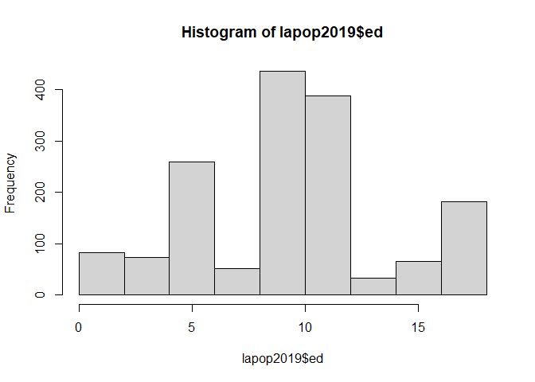<!-- -->

Le podemos modificar el título del eje de las x y de las y

``` r
hist(lapop2019$ed, 
     main="Histograma de la edad", 
     xlab="Hrs", ylab="Frecuencia") 
```

<!-- -->

¡A ponerle colorcitos! Aquí hay una lista
<http://www.stat.columbia.edu/~tzheng/files/Rcolor.pdf>

``` r
hist(lapop2019$ed, 
     main="Histograma de edades",
     xlab="Horas", 
     ylab="Frecuencia", col="deeppink1") 
```

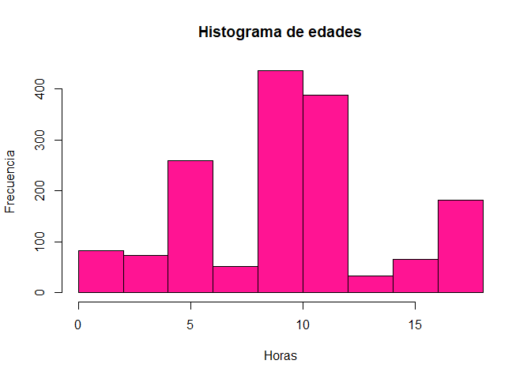<!-- -->

## con pipes

``` r
lapop2019 %>% 
    with(hist(ed)) # con with, para que entienda
```

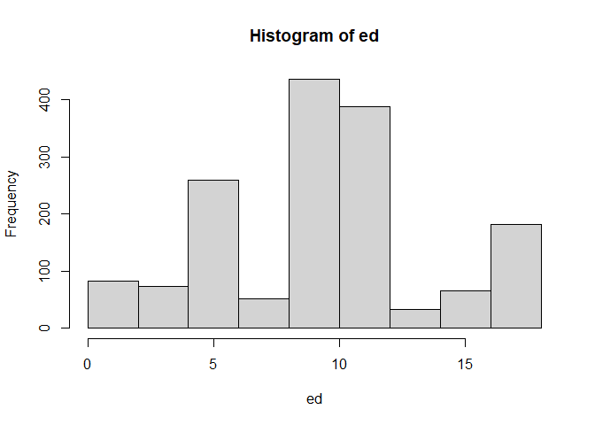<!-- -->

Cuando usamos pipes, se debe de recordar que no es necesario escribir el
nombre del data.frame en el filtro porque es lo primero que colocamos en
nuestro “pipe”.

Checa que cualquier aditamiento debe ir en el pipe donde está el comando
de hist(). Ten cuidado con los paréntesis.

``` r
lapop2019 %>% 
  filter(!is.na(ed)) %>% # la ventaja de esta forma es que podemos hacer más operaciones
with(hist(ed, main= "histograma"))
```

<!-- -->

# ¿Cuál es el mejor gráfico?

Hay cursos específicos de visualización de datos. Es maravilloso pero
también requiere que estudiemos bien qué tipo de datos tenemos y cuáles
son nuestros objetivos.

Me gusta mucho este recurso: <https://www.data-to-viz.com/>

# Gráficos de base

“plot()” Es la función más simple. Y es otro comando “listo”

``` r
  plot(as_label(lapop2019$soct2))
```

<!-- -->

Esto es igual que:

``` r
barplot(table(as_label(lapop2019$soct2)))
```

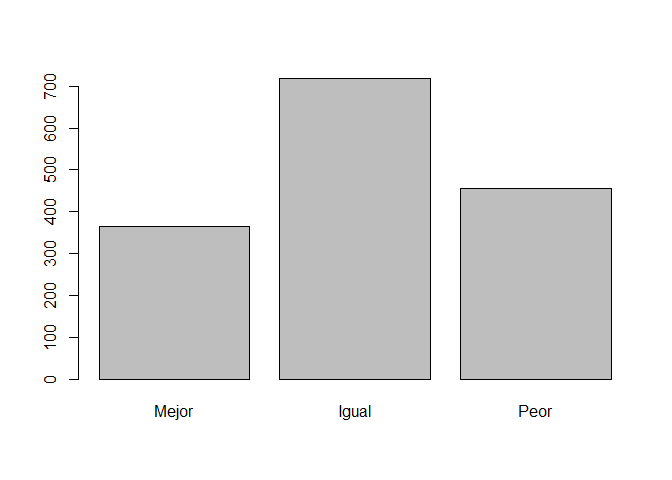<!-- -->

``` r
  plot(as_label(lapop2019$soct2), 
       main=paste(get_label(lapop2019$soct2)))
```

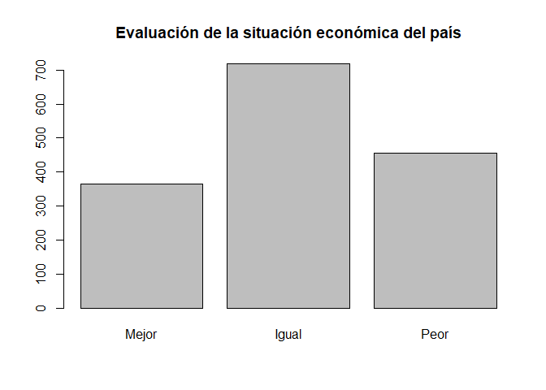<!-- -->

También tnemos histograma y el boxplot.

``` r
hist(ICI_2018$esperanza_de_vida)
```

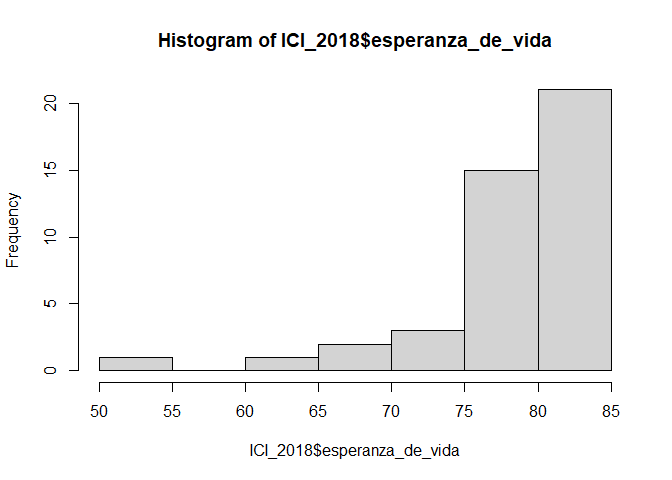<!-- -->

``` r
boxplot(ICI_2018$esperanza_de_vida)
```

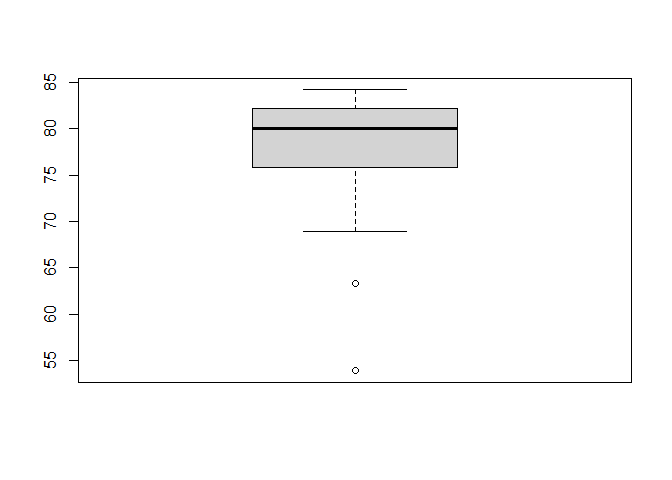<!-- -->

ES MUY PROBABLE QUE ESTA PRÁCTICA NOS SIRVA PARA AMBOS DÍAS

# Gráficos con ggplot

Hoy vamos a presentar a un gran paquete ¡Es de los famosos! Y tiene más
de diez años.

-   <https://qz.com/1007328/all-hail-ggplot2-the-code-powering-all-those-excellent-charts-is-10-years-old/>

“gg” proviene de “Grammar of Graphics”, funciona un poco como
sintácticamente, de ahí su nombre.

Algunos recursos para aprender ggplot

-   <https://ggplot2-book.org/> hecha por el mero mero.

-   <http://sape.inf.usi.ch/quick-reference/ggplot2>

-   <https://raw.githubusercontent.com/rstudio/cheatsheets/master/data-visualization-2.1.pdf>

Vamos a revisar una presentación que es muy interesante

-   <https://evamaerey.github.io/ggplot2_grammar_guide/ggplot2_grammar_guide.html>

-   <https://huygens.science.uva.nl/ggPlotteR/> Hace gráficos de ggplot
    con la base de datos de Gapminder

# Vamos a jugar con esquisse

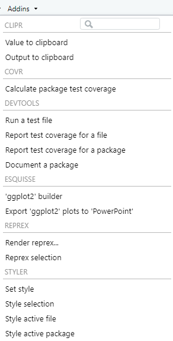

En “ggplot2 builder” vamos a tener un menú “drag and drop”

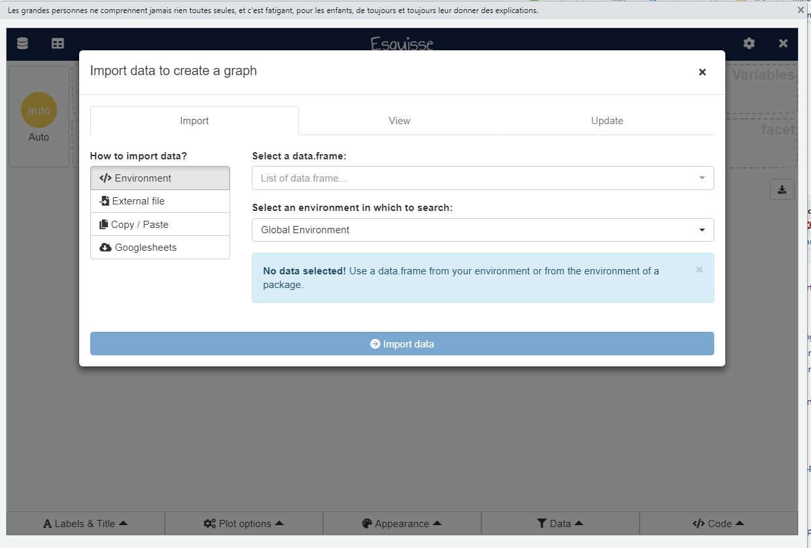

# ggplot2 con comandos

## Un lienzo para dibujar

Para hacer un gráfico, ggplot2 tiene el comando “ggplot()”. Hacer
gráficos con esta función tiene una lógica aditiva. Lo ideal es que
iniciemos estableciendo el mapeo estético de nuestro gráfico, con el
comando aes()

``` r
g1<-lapop2019 %>%
  ggplot(aes(as_label(soct2)))

g1 # imprime el lienzo
```

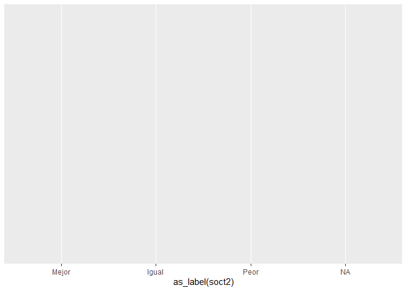<!-- -->

# Gráficos univariados

## Para cualitativas

``` r
g1 + geom_bar()
```

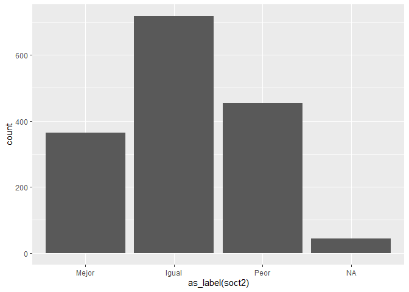<!-- -->

``` r
g1 +  geom_bar(aes(
  fill = as_label(q1)
  )) # colorea la geometría
```

<!-- -->

``` r
# Esto es equivalente

lapop2019 %>%
  ggplot(aes(as_label(soct2),
             fill = as_label(q1)
             )
         ) + geom_bar()
```

<!-- --> \#\# Para
variables cuantitativas Podemos hacer histogramas y gráficos de
densidad, de manera fácil. La idea es agregar en nuestro “lienzo” una
geometría, un valor para dibujar en él. Esto se agrega con un “+” y con
la figura que se añadirá a nuestro gráfico.

``` r
g2<-lapop2019 %>%
  ggplot(aes(ed))

g2 # imprime el lienzo
```

    ## Don't know how to automatically pick scale for object of type haven_labelled/vctrs_vctr/double. Defaulting to continuous.

<!-- -->

### Histograma

``` r
g2 + geom_histogram() 
```

    ## Don't know how to automatically pick scale for object of type haven_labelled/vctrs_vctr/double. Defaulting to continuous.

    ## `stat_bin()` using `bins = 30`. Pick better value with `binwidth`.

    ## Warning: Removed 12 rows containing non-finite values (stat_bin).

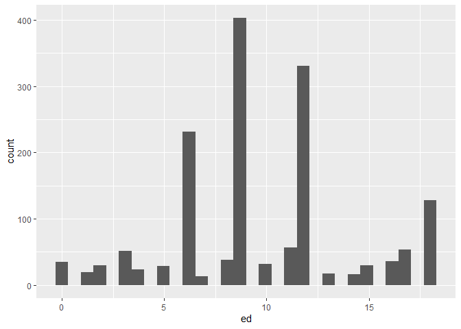<!-- --> No es igual al
histograma de base por el número de “cajas”. Esto lo podemos modificar:

``` r
g2 + geom_histogram(bins=10) 
```

    ## Don't know how to automatically pick scale for object of type haven_labelled/vctrs_vctr/double. Defaulting to continuous.

    ## Warning: Removed 12 rows containing non-finite values (stat_bin).

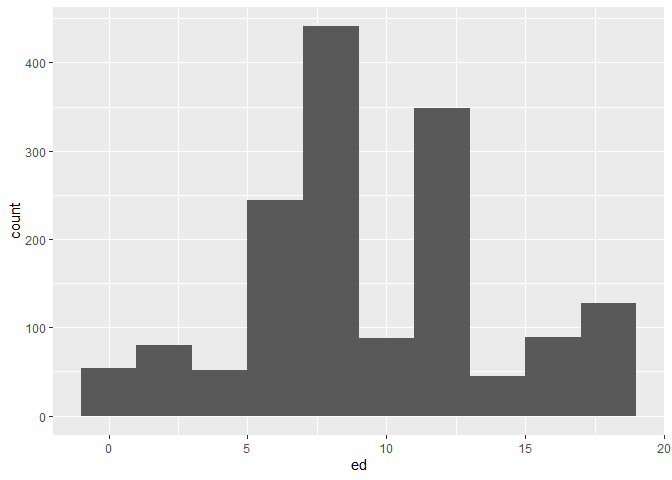<!-- -->

### Densidad

``` r
g2 + geom_density()
```

    ## Don't know how to automatically pick scale for object of type haven_labelled/vctrs_vctr/double. Defaulting to continuous.

    ## Warning: Removed 12 rows containing non-finite values (stat_density).

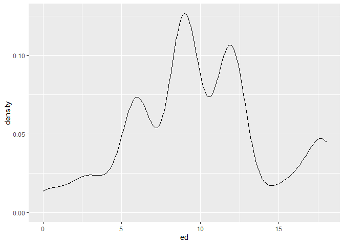<!-- -->

# Gráficos bivariados

## Cuali-cuali

``` r
g1 +  geom_bar(aes(fill = as_label(q1)),
              position="dodge") #pone las categorías lado a lado y no apiladas
```

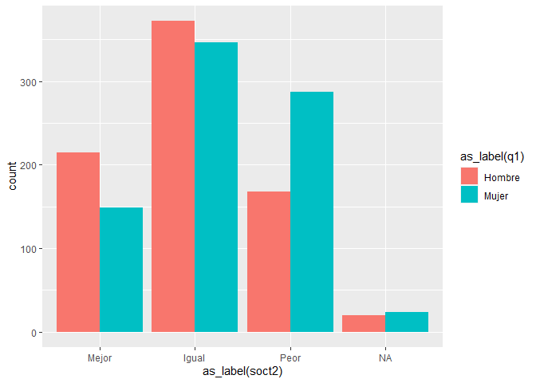<!-- -->

Otra manera interesante de observar estas variables, es que estándo
apiladas, cada categoría de escolaridad se entendiera como una unidad:

``` r
g_bivariado <- g1 +  geom_bar(aes(fill = as_label(q1)),
              position="fill") # cada categoría "llena" a una unidad

g_bivariado
```

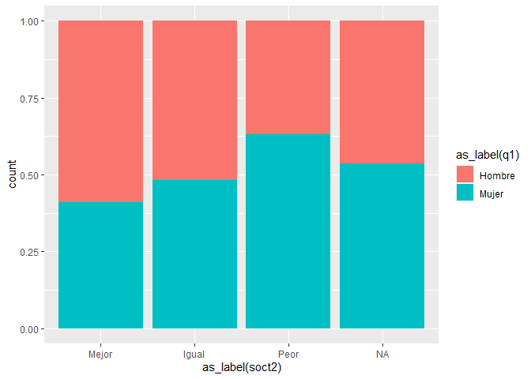<!-- -->

Escalas de color: RcolorBrewer es el más famoso.

``` r
g_bivariado + scale_fill_brewer(palette = "Dark2")
```

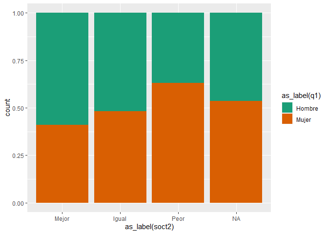<!-- -->

Cambiamos el tema:

``` r
g_bivariado + scale_fill_brewer(palette = "Dark2") + theme_minimal()
```

<!-- -->

## Cuanti - cuanti

Los gráficos más usuales son los *scatter plot*

``` r
ICI_2018 %>% 
  ggplot(aes(indice_de_gini,
             indice_de_vulnerabilidad_a_efectos_del_cambio_climatico)) +
  geom_point()
```

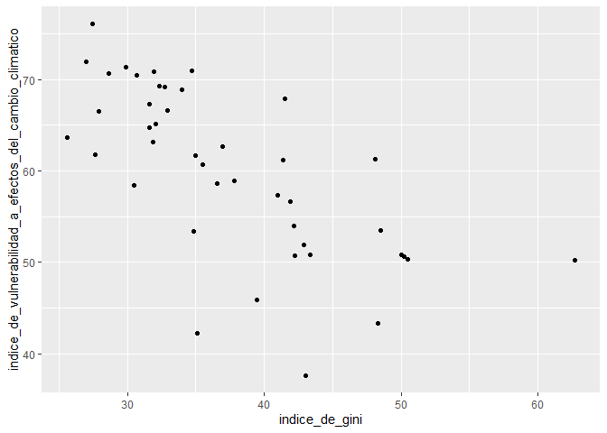<!-- -->

Hay otra geometría que puede ser útil: la geometría “jitter”

``` r
ICI_2018 %>% 
  ggplot(aes(indice_de_gini,
             indice_de_vulnerabilidad_a_efectos_del_cambio_climatico)) +
  geom_jitter()
```

<!-- --> En lugar de
puntos podemos incluir texto:

``` r
# geometría "text"

ICI_2018 %>% 
  ggplot(aes(indice_de_gini,indice_de_vulnerabilidad_a_efectos_del_cambio_climatico)) +
  geom_text(aes(label=indicador))
```

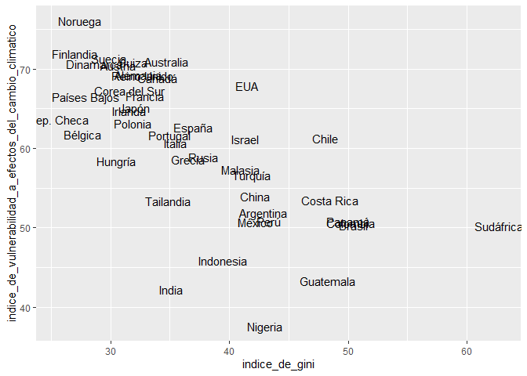<!-- -->

``` r
# geometría "label"

ICI_2018 %>% 
  ggplot(aes(indice_de_gini,indice_de_vulnerabilidad_a_efectos_del_cambio_climatico)) +
  geom_label(aes(label=indicador))
```

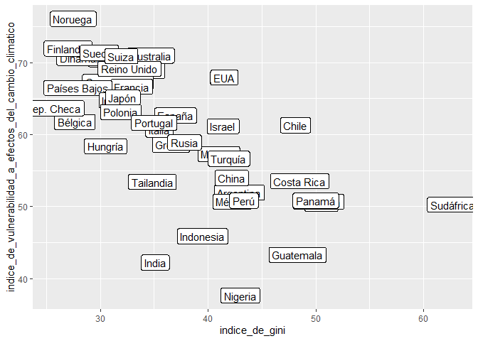<!-- -->

### Una tercera variable

Aprovechamos para etiquetar

``` r
etiqueta<-c("No miembro", "Miembro")
ICI_2018<-ICI_2018 %>% 
  set_labels(miembro_de_la_alianza_para_el_gobierno_abierto, labels=etiqueta)
```

¿Ese nombre nos es útil? Está larguísimo. Podemos renombrar:

``` r
ICI_2018<-ICI_2018 %>% 
  dplyr::rename(miembros_al=miembro_de_la_alianza_para_el_gobierno_abierto)
```

Una vez ya etiquetada vamos incluirlo como un punto diferente por color
o por forma:

``` r
# Introducción de una tercera variable con color

ICI_2018 %>% 
  ggplot(aes(x=indice_de_gini,
             y=indice_de_vulnerabilidad_a_efectos_del_cambio_climatico,
             color=as_label(miembros_al))
         ) +
  geom_point()
```

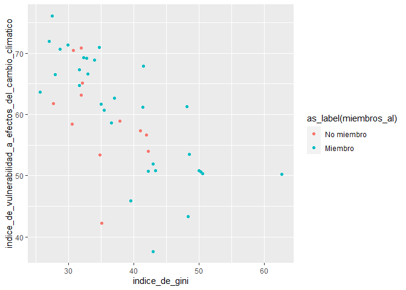<!-- -->

``` r
# Introducción de una tercera variable con "shape"

ICI_2018 %>% 
  ggplot(aes(x=indice_de_gini,
             y=indice_de_vulnerabilidad_a_efectos_del_cambio_climatico,
             shape=as_label(miembros_al))
  ) +
  geom_point() # ojo, hay un límite para las formas
```

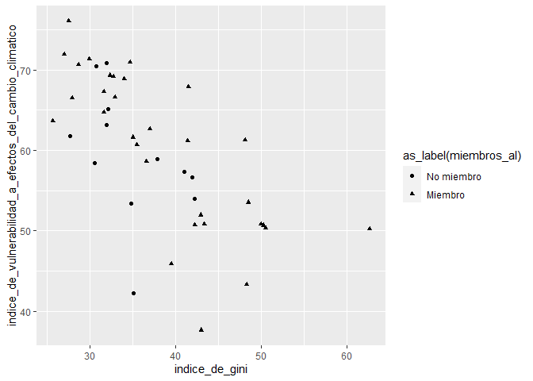<!-- -->
