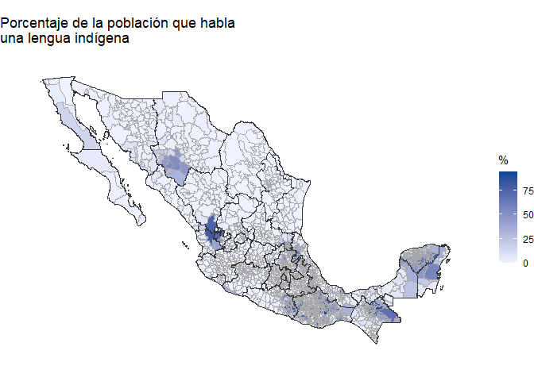

Práctica 4 - Mapas y texto
================
Ana Escoto
23/06/2021

# Previo

## Paquetería

``` r
rm(list=ls()) ### borra objetos en el ambiente

# Para los mapas
if (!require("pacman")) install.packages("pacman") # instala pacman si se requiere
```

    ## Loading required package: pacman

``` r
pacman::p_load(tidyverse, readxl,janitor,
               haven, 
               remotes) #carga los paquetes necesarios
```

## Paquetes en desarrollo

Hay otros paquetes que no están en CRAN ¿alguna persona conocerá todos
los paquetes de CRAN?

Para poder instalar este tipo de paquetes, usamos la paquetería
“remotes”, y luego se puede instalar desde el repositorio de GitHub
donde estáé alojado el paquete:

``` r
#if (!require("remotes")) {
#  install.packages("remotes")
# }

#remotes::install_github("diegovalle/mxmaps") # mapas
#https://www.diegovalle.net/mxmaps/

# Hay que cargar los instalados

library(mxmaps)
```

# Datos

Usaremos la base de IMCO del índice de competitividad estatal

``` r
ICE_2021 <- read_excel("datos/ICE_2021.xlsx", sheet = "para_importar")
```

    ## New names:
    ## * `` -> ...77

``` r
ICE_2021 <- clean_names(ICE_2021) # limpia los nombres
```

# Mapas

Puesdes consultar el sitio oficial del paquete
<https://www.diegovalle.net/mxmaps/>

Este paquete tiene bases de datos ya preinstaladas. Esto es normal.
Muchos paquetes las tienen sobre todo para los ejemplos. A mi me gusta
usar datos más rupestres jeje.

¿Cómo llamamos una base de un paquete instalado y cargado? Pues con el
comando “data()”

``` r
data("df_mxstate_2020") # carga la base estatal del paquete
glimpse(df_mxstate_2020)
```

    ## Rows: 32
    ## Columns: 11
    ## $ region              <chr> "01", "02", "03", "04", "05", "06", "07", "08", "0~
    ## $ state_name          <chr> "Aguascalientes", "Baja California", "Baja Califor~
    ## $ state_name_official <chr> "Aguascalientes", "Baja California", "Baja Califor~
    ## $ state_abbr          <chr> "AGS", "BC", "BCS", "CAMP", "COAH", "COL", "CHPS",~
    ## $ state_abbr_official <chr> "Ags.", "BC", "BCS", "Camp.", "Coah.", "Col.", "Ch~
    ## $ year                <dbl> 2020, 2020, 2020, 2020, 2020, 2020, 2020, 2020, 20~
    ## $ pop                 <int> 1425607, 3769020, 798447, 928363, 3146771, 731391,~
    ## $ pop_male            <int> 696683, 1900589, 405879, 456939, 1563669, 360622, ~
    ## $ pop_female          <int> 728924, 1868431, 392568, 471424, 1583102, 370769, ~
    ## $ afromexican         <int> 22425, 64362, 26330, 19319, 45976, 13574, 56532, 6~
    ## $ indigenous_language <int> 2539, 49130, 13581, 91801, 5527, 5210, 1459648, 11~

¿Cómo opera el paquete de *mxmaps*?

``` r
df_mxstate_2020$value <- df_mxstate_2020$pop # paso esencial

glimpse(df_mxstate_2020$region)
```

    ##  chr [1:32] "01" "02" "03" "04" "05" "06" "07" "08" "09" "10" "11" "12" ...

``` r
mxstate_choropleth(df_mxstate_2020,
                   title = "Total población, por Estado") 
```

<!-- -->

Voilá, el mapita.

¿Pero esto significa que sólo podemos mapear datos del censo?
No. Mientras haya una variable de region estatal en nuestra base,
podemos utilizar, todo el choropleth ya lo carga el paquete. Veamos una
aplicación con la base ICE\_2021

``` r
ICE_2021$value<- ICE_2021$homicidios

mxstate_choropleth(ICE_2021,
                   title = "Tasa de homicidios") 
```

<!-- -->

``` r
mapa<-mxstate_choropleth(ICE_2021,
                         title = "Tasa de homicidios") 
mapa #imprime
```

<!-- -->

¿Cómo guardamos este mapa y cualquier archivo de ggplot?

Lo guardará en nuestro directorio y en formato “.png” de imagen

## Mapas municipales

Para eso necesitamos una base a nivel municipal. Carguemola

``` r
data("df_mxmunicipio_2020")

df_mxmunicipio_2020$value <-df_mxmunicipio_2020$indigenous_language/df_mxmunicipio_2020$pop * 100

mxmunicipio_choropleth(df_mxmunicipio_2020, 
                       num_colors = 1,
                       title = "Porcentaje de la población que habla\nuna lengua indígena",
                       legend = "%")
```

<!-- -->

Si queremos hacer un “zoom”

``` r
mxmunicipio_choropleth(df_mxmunicipio_2020, 
                       num_colors = 1,
                       zoom = subset(df_mxmunicipio_2020, state_name %in% 
                                       c("Yucatán", "Veracruz"))$region,
                       title = "Porcentaje de la población que habla\nuna lengua indígena en Yucatány Veracruz",
                       show_states = FALSE,
                       legend = "%")
```

<!-- -->

``` r
rm(df_mxmunicipio_2020, mapa,df_mxstate_2020) # nos roba mucha memoria
```

Es importante liberar nuestro ambiente porque estamos limitado en
rstudio.cloud.

``` r
detach("package:mxmaps", unload = TRUE)
```

# Intro al análisis de Texto

Vamos a limpiar todo y volver a cargar las librerías. Podríamos
reiniciar nuestro R.

``` r
rm(list=ls()) ### borra objetos en el ambiente

# Para texto
pacman::p_load(tidyverse, tm, NLP, SnowballC, wordcloud, ggwordcloud,
               quanteda, udpipe, ggraph, igraph,
               sjlabelled, RColorBrewer, readxl, janitor, textrank,
               broom, wesanderson, epubr, pdftools)
```

## Insumos - ¿dónde están?

Vamos a guardar los “caminos” dónde están los archivos con los que vamos
a trabajar en objetos. R es un lenguaje de programación por objetos.
Tenemos que declarar la información en objetos para poderla utilizar

``` r
## Insumos
path1<-"./datos/kawabata.epub" # formato epub
path2<-"./datos/lobo_antunes.pdf" #formato pdf
path3<-"./datos/amlo_mar2021.txt" #formato txt
```

## Tokenización y revisión UPOS

### Importando modelo de tokenización

``` r
udmodel <- udpipe_download_model(language = "spanish")  # esto trabaja con la estructura del español
```

    ## Downloading udpipe model from https://raw.githubusercontent.com/jwijffels/udpipe.models.ud.2.5/master/inst/udpipe-ud-2.5-191206/spanish-gsd-ud-2.5-191206.udpipe to C:/Users/anaes/Dropbox/2021/CursoR-posgrado/spanish-gsd-ud-2.5-191206.udpipe

    ##  - This model has been trained on version 2.5 of data from https://universaldependencies.org

    ##  - The model is distributed under the CC-BY-SA-NC license: https://creativecommons.org/licenses/by-nc-sa/4.0

    ##  - Visit https://github.com/jwijffels/udpipe.models.ud.2.5 for model license details.

    ##  - For a list of all models and their licenses (most models you can download with this package have either a CC-BY-SA or a CC-BY-SA-NC license) read the documentation at ?udpipe_download_model. For building your own models: visit the documentation by typing vignette('udpipe-train', package = 'udpipe')

    ## Downloading finished, model stored at 'C:/Users/anaes/Dropbox/2021/CursoR-posgrado/spanish-gsd-ud-2.5-191206.udpipe'

### Formato epub

Vamos a importar un libro desde su formato epub. Este formato es mejor
que el de pdf porque no tenemos tantos cortes por páginas.

``` r
epub_head(path1) # muestra lo primero
```

    ## # A tibble: 25 x 2
    ##    section           text                                                       
    ##    <chr>             <chr>                                                      
    ##  1 Section0018.xhtml "Cuando Keiko llegó a la casa de té de Ofusa encont"       
    ##  2 cubierta.xhtml    ""                                                         
    ##  3 sinopsis.xhtml    " \n\n  Impulsado por la nostalgia, Oki Toshio, un es"     
    ##  4 titulo.xhtml      "Yasunari Kawabata\n\n  Lo bello y lo triste\n\n  <U+7F8E><U+3057><U+3055><U+3068>~
    ##  5 info.xhtml        "Título original:<U+7F8E><U+3057><U+3055><U+3068><U+54C0><U+3057><U+307F><U+3068> (Utsukushisa to kanashim~
    ##  6 dedicatoria.xhtml "Lo bello y lo triste"                                     
    ##  7 Section0002.xhtml "Eran seis las butacas giratorias que se alineaban "       
    ##  8 Section0004.xhtml "Oki se había detenido en una colina, con la mirada"       
    ##  9 Section0006.xhtml "Otoko proyectaba llevar a Keiko al templo del mont"       
    ## 10 Section0008.xhtml "Cuando se cansaba de escribir o cuando una novela "       
    ## # ... with 15 more rows

``` r
epub_meta(path1) # muestra el meta-data del libro
```

    ## # A tibble: 1 x 9
    ##   identifier   title  subject  creator description   contributor publisher date 
    ##   <chr>        <chr>  <chr>    <chr>   <chr>         <chr>       <chr>     <chr>
    ## 1 urn:uuid:ep~ Lo be~ Drama, ~ Yasuna~ Impulsado po~ Nélida M. ~ Emecé Li~ 1965~
    ## # ... with 1 more variable: language <chr>

``` r
x <- epub(path1) # Importa todo el libro en el objeto x, pero no queremos todo
x
```

    ## # A tibble: 1 x 10
    ##   identifier   title  subject  creator description   contributor publisher date 
    ##   <chr>        <chr>  <chr>    <chr>   <chr>         <chr>       <chr>     <chr>
    ## 1 urn:uuid:ep~ Lo be~ Drama, ~ Yasuna~ Impulsado po~ Nélida M. ~ Emecé Li~ 1965~
    ## # ... with 2 more variables: language <chr>, data <list>

``` r
class(x)
```

    ## [1] "tbl_df"     "tbl"        "data.frame"

Para los que trabajan en otro proyecto, descomentar y seleccionar el
archivo

``` r
#x<-epub(file.choose())
```

Como observamos lo que queremos son las secciones que realmente tiene
nuestro texto (¡aunque quizás también analizar contraportadas sea otro
tema de análisis!)

``` r
x$data # esto muestra que aquí adentro está lo que queremos
```

    ## [[1]]
    ## # A tibble: 25 x 4
    ##    section        text                                               nword nchar
    ##    <chr>          <chr>                                              <int> <int>
    ##  1 Section0018.x~ "Cuando Keiko llegó a la casa de té de Ofusa enco~  7436 43690
    ##  2 cubierta.xhtml ""                                                     0     0
    ##  3 sinopsis.xhtml " \n\n  Impulsado por la nostalgia, Oki Toshio, u~    92   540
    ##  4 titulo.xhtml   "Yasunari Kawabata\n\n  Lo bello y lo triste\n\n ~    11    86
    ##  5 info.xhtml     "Título original:<U+7F8E><U+3057><U+3055><U+3068><U+54C0><U+3057><U+307F><U+3068> (Utsukushisa to~    30   285
    ##  6 dedicatoria.x~ "Lo bello y lo triste"                                 5    20
    ##  7 Section0002.x~ "Eran seis las butacas giratorias que se alineaba~  5990 34930
    ##  8 Section0004.x~ "Oki se había detenido en una colina, con la mira~  7454 43536
    ##  9 Section0006.x~ "Otoko proyectaba llevar a Keiko al templo del mo~  4601 27247
    ## 10 Section0008.x~ "Cuando se cansaba de escribir o cuando una novel~  3564 20724
    ## # ... with 15 more rows

``` r
epub_kaw<-x$data[[1]] # Nos quedamos con esa base de datos
epub_kaw<-epub_kaw[7, ]  # Nos quedamos con el cuento Campanas del templo
```

## Nuestra obra tokenizada

Una vez que ya tenemos un objeto con la información que necesitamos,
usaremos nuestro modelo para tokenizarla. Este resultado lo guardaremos
en un objeto.

``` r
kawabata<-udpipe(x = paste(epub_kaw$text), #paste nos asegura que se pegue como caracter
                      object=udmodel) #"tokeniza" el texto
```

Vamos a revisar ese objeto “tokenizado”

``` r
glimpse(kawabata)
```

    ## Rows: 7,113
    ## Columns: 17
    ## $ doc_id        <chr> "doc1", "doc1", "doc1", "doc1", "doc1", "doc1", "doc1", ~
    ## $ paragraph_id  <int> 1, 1, 1, 1, 1, 1, 1, 1, 1, 1, 1, 1, 1, 1, 1, 1, 1, 1, 1,~
    ## $ sentence_id   <int> 1, 1, 1, 1, 1, 1, 1, 1, 1, 1, 1, 1, 1, 1, 1, 1, 1, 1, 1,~
    ## $ sentence      <chr> "Eran seis las butacas giratorias que se alineaban sobre~
    ## $ start         <int> 1, 6, 11, 15, 23, 34, 38, 41, 51, 57, 60, 65, 73, NA, NA~
    ## $ end           <int> 4, 9, 13, 21, 32, 36, 39, 49, 55, 58, 63, 71, 75, NA, NA~
    ## $ term_id       <int> 1, 2, 3, 4, 5, 6, 7, 8, 9, 10, 11, 12, 13, 14, 15, 16, 1~
    ## $ token_id      <chr> "1", "2", "3", "4", "5", "6", "7", "8", "9", "10", "11",~
    ## $ token         <chr> "Eran", "seis", "las", "butacas", "giratorias", "que", "~
    ## $ lemma         <chr> "ser", "6", "el", "butaco", "giratoria", "que", "él", "a~
    ## $ upos          <chr> "VERB", "NUM", "DET", "ADJ", "NOUN", "SCONJ", "PRON", "V~
    ## $ xpos          <chr> NA, NA, NA, NA, NA, NA, NA, NA, NA, NA, NA, NA, NA, NA, ~
    ## $ feats         <chr> "Mood=Sub|Number=Plur|Person=3|Tense=Imp|VerbForm=Fin", ~
    ## $ head_token_id <chr> "0", "5", "5", "5", "1", "8", "8", "5", "11", "11", "8",~
    ## $ dep_rel       <chr> "root", "nummod", "det", "amod", "nsubj", "mark", "iobj"~
    ## $ deps          <chr> NA, NA, NA, NA, NA, NA, NA, NA, NA, NA, NA, NA, NA, NA, ~
    ## $ misc          <chr> NA, NA, NA, NA, NA, NA, NA, NA, NA, NA, NA, NA, NA, NA, ~

Nos vamos a concentrar en la variable “upos”, proviende de UPOS
*Universal Parts of Speech*
<https://universaldependencies.org/u/pos/index.html>

``` r
kawabata %>% 
  tabyl(upos) # esto nos da un tabulado
```

    ##   upos    n      percent valid_percent
    ##    ADJ  359 0.0504709686  0.0515952860
    ##    ADP  949 0.1334176859  0.1363897672
    ##    ADV  346 0.0486433291  0.0497269330
    ##    AUX  259 0.0364122030  0.0372233400
    ##  CCONJ  194 0.0272740053  0.0278815752
    ##    DET  959 0.1348235625  0.1378269618
    ##   INTJ    8 0.0011247013  0.0011497557
    ##   NOUN 1170 0.1644875580  0.1681517677
    ##    NUM   50 0.0070293828  0.0071859730
    ##   PRON  445 0.0625615071  0.0639551595
    ##  PROPN  232 0.0326163363  0.0333429146
    ##  PUNCT  815 0.1145789400  0.1171313596
    ##  SCONJ  225 0.0316322227  0.0323368784
    ##   VERB  941 0.1322929847  0.1352400115
    ##      X    6 0.0008435259  0.0008623168
    ##   <NA>  155 0.0217910867            NA

## Revisando elementos UPOS

### Nombres

Vamos a revisar un tipo especial, los sustantivos. “NOUN”, en inglés

Veamos para el caso de nuestra primera novela

``` r
stats<- kawabata %>% 
  filter(upos=="NOUN")

stats.freq <- txt_freq(stats$token)
stats.freq$key <- factor(stats.freq$key, levels = rev(stats.freq$key)) # ordena

stats.freq[1:25,] %>% 
  ggplot(aes(x=key, y=freq)) +geom_bar(stat="identity") + 
  coord_flip() + labs(y="Frecuencia", x="Sustantivo") + theme_minimal()
```

<!-- -->

### Nube de sustantivos

Con esto podemos hacer una nube, esas son famosas:

``` r
set.seed(42) # tiene un elemento aleatorio

stats.freq[1:25,] %>% 
  ggplot(aes(label=key, size=freq)) +  geom_text_wordcloud() +
  theme_minimal()
```

    ## Warning in png(filename = tmp_file, width = gw_pix, height = gh_pix, res =
    ## dev_dpi, : 'width=12, height=12' are unlikely values in pixels

    ## Warning in png(filename = tmp_file, width = gw_pix, height = gh_pix, res =
    ## dev_dpi, : 'width=16, height=12' are unlikely values in pixels

    ## Warning in png(filename = tmp_file, width = gw_pix, height = gh_pix, res =
    ## dev_dpi, : 'width=12, height=12' are unlikely values in pixels

    ## Warning in png(filename = tmp_file, width = gw_pix, height = gh_pix, res =
    ## dev_dpi, : 'width=12, height=12' are unlikely values in pixels

<!-- --> La vamos a poner
más chula:

``` r
stats.freq[1:25,] %>% 
    ggplot(
        aes(
        label =key, size = freq,
        color = factor(sample.int(15, nrow(stats.freq[1:25,]), replace = TRUE))
        )
    ) +
      geom_text_wordcloud_area() +
      scale_size_area(max_size = 12) +
      theme_minimal()
```

<!-- -->

Otra paquetería, es más fácil pero menos editable

``` r
set.seed(1234)

paleta_color<-wes_palette(n=5,
                          name="Darjeeling1",
                          type="continuous")

wordcloud(words = stats.freq$key, freq = stats.freq$freq,
          min.freq = 5,
          max.words=200, 
          random.order=FALSE, 
          colors=paleta_color)
```

<!-- -->

## Adjetivos

Vamos a encontrar los adjetivos más usados

``` r
stats<- kawabata %>% 
  filter(upos=="ADJ") #checa que esto sobreescribe los objetos que teníamos

stats.freq <- txt_freq(stats$token)
stats.freq$key <- factor(stats.freq$key, levels = rev(stats.freq$key)) # ordena

stats.freq[1:25,] %>% 
  ggplot(aes(x=key, y=freq)) +geom_bar(stat="identity") + 
  coord_flip() + labs(y="Frecuencia", x="Adjetivo") + theme_minimal()
```

<!-- -->

## Todas las palabras

Cuando analizamos texto hay palabras que son muy comunes.

``` r
#Elegir palabras comunes
stopwords("spanish") # de la paquetería quanteda
```

    ##   [1] "de"           "la"           "que"          "el"           "en"          
    ##   [6] "y"            "a"            "los"          "del"          "se"          
    ##  [11] "las"          "por"          "un"           "para"         "con"         
    ##  [16] "no"           "una"          "su"           "al"           "lo"          
    ##  [21] "como"         "más"          "pero"         "sus"          "le"          
    ##  [26] "ya"           "o"            "este"         "sí"           "porque"      
    ##  [31] "esta"         "entre"        "cuando"       "muy"          "sin"         
    ##  [36] "sobre"        "también"      "me"           "hasta"        "hay"         
    ##  [41] "donde"        "quien"        "desde"        "todo"         "nos"         
    ##  [46] "durante"      "todos"        "uno"          "les"          "ni"          
    ##  [51] "contra"       "otros"        "ese"          "eso"          "ante"        
    ##  [56] "ellos"        "e"            "esto"         "mí"           "antes"       
    ##  [61] "algunos"      "qué"          "unos"         "yo"           "otro"        
    ##  [66] "otras"        "otra"         "él"           "tanto"        "esa"         
    ##  [71] "estos"        "mucho"        "quienes"      "nada"         "muchos"      
    ##  [76] "cual"         "poco"         "ella"         "estar"        "estas"       
    ##  [81] "algunas"      "algo"         "nosotros"     "mi"           "mis"         
    ##  [86] "tú"           "te"           "ti"           "tu"           "tus"         
    ##  [91] "ellas"        "nosotras"     "vosotros"     "vosotras"     "os"          
    ##  [96] "mío"          "mía"          "míos"         "mías"         "tuyo"        
    ## [101] "tuya"         "tuyos"        "tuyas"        "suyo"         "suya"        
    ## [106] "suyos"        "suyas"        "nuestro"      "nuestra"      "nuestros"    
    ## [111] "nuestras"     "vuestro"      "vuestra"      "vuestros"     "vuestras"    
    ## [116] "esos"         "esas"         "estoy"        "estás"        "está"        
    ## [121] "estamos"      "estáis"       "están"        "esté"         "estés"       
    ## [126] "estemos"      "estéis"       "estén"        "estaré"       "estarás"     
    ## [131] "estará"       "estaremos"    "estaréis"     "estarán"      "estaría"     
    ## [136] "estarías"     "estaríamos"   "estaríais"    "estarían"     "estaba"      
    ## [141] "estabas"      "estábamos"    "estabais"     "estaban"      "estuve"      
    ## [146] "estuviste"    "estuvo"       "estuvimos"    "estuvisteis"  "estuvieron"  
    ## [151] "estuviera"    "estuvieras"   "estuviéramos" "estuvierais"  "estuvieran"  
    ## [156] "estuviese"    "estuvieses"   "estuviésemos" "estuvieseis"  "estuviesen"  
    ## [161] "estando"      "estado"       "estada"       "estados"      "estadas"     
    ## [166] "estad"        "he"           "has"          "ha"           "hemos"       
    ## [171] "habéis"       "han"          "haya"         "hayas"        "hayamos"     
    ## [176] "hayáis"       "hayan"        "habré"        "habrás"       "habrá"       
    ## [181] "habremos"     "habréis"      "habrán"       "habría"       "habrías"     
    ## [186] "habríamos"    "habríais"     "habrían"      "había"        "habías"      
    ## [191] "habíamos"     "habíais"      "habían"       "hube"         "hubiste"     
    ## [196] "hubo"         "hubimos"      "hubisteis"    "hubieron"     "hubiera"     
    ## [201] "hubieras"     "hubiéramos"   "hubierais"    "hubieran"     "hubiese"     
    ## [206] "hubieses"     "hubiésemos"   "hubieseis"    "hubiesen"     "habiendo"    
    ## [211] "habido"       "habida"       "habidos"      "habidas"      "soy"         
    ## [216] "eres"         "es"           "somos"        "sois"         "son"         
    ## [221] "sea"          "seas"         "seamos"       "seáis"        "sean"        
    ## [226] "seré"         "serás"        "será"         "seremos"      "seréis"      
    ## [231] "serán"        "sería"        "serías"       "seríamos"     "seríais"     
    ## [236] "serían"       "era"          "eras"         "éramos"       "erais"       
    ## [241] "eran"         "fui"          "fuiste"       "fue"          "fuimos"      
    ## [246] "fuisteis"     "fueron"       "fuera"        "fueras"       "fuéramos"    
    ## [251] "fuerais"      "fueran"       "fuese"        "fueses"       "fuésemos"    
    ## [256] "fueseis"      "fuesen"       "siendo"       "sido"         "tengo"       
    ## [261] "tienes"       "tiene"        "tenemos"      "tenéis"       "tienen"      
    ## [266] "tenga"        "tengas"       "tengamos"     "tengáis"      "tengan"      
    ## [271] "tendré"       "tendrás"      "tendrá"       "tendremos"    "tendréis"    
    ## [276] "tendrán"      "tendría"      "tendrías"     "tendríamos"   "tendríais"   
    ## [281] "tendrían"     "tenía"        "tenías"       "teníamos"     "teníais"     
    ## [286] "tenían"       "tuve"         "tuviste"      "tuvo"         "tuvimos"     
    ## [291] "tuvisteis"    "tuvieron"     "tuviera"      "tuvieras"     "tuviéramos"  
    ## [296] "tuvierais"    "tuvieran"     "tuviese"      "tuvieses"     "tuviésemos"  
    ## [301] "tuvieseis"    "tuviesen"     "teniendo"     "tenido"       "tenida"      
    ## [306] "tenidos"      "tenidas"      "tened"

``` r
stop<-stopwords("spanish") # guarda todas esas palabras en un objeto
stop
```

    ##   [1] "de"           "la"           "que"          "el"           "en"          
    ##   [6] "y"            "a"            "los"          "del"          "se"          
    ##  [11] "las"          "por"          "un"           "para"         "con"         
    ##  [16] "no"           "una"          "su"           "al"           "lo"          
    ##  [21] "como"         "más"          "pero"         "sus"          "le"          
    ##  [26] "ya"           "o"            "este"         "sí"           "porque"      
    ##  [31] "esta"         "entre"        "cuando"       "muy"          "sin"         
    ##  [36] "sobre"        "también"      "me"           "hasta"        "hay"         
    ##  [41] "donde"        "quien"        "desde"        "todo"         "nos"         
    ##  [46] "durante"      "todos"        "uno"          "les"          "ni"          
    ##  [51] "contra"       "otros"        "ese"          "eso"          "ante"        
    ##  [56] "ellos"        "e"            "esto"         "mí"           "antes"       
    ##  [61] "algunos"      "qué"          "unos"         "yo"           "otro"        
    ##  [66] "otras"        "otra"         "él"           "tanto"        "esa"         
    ##  [71] "estos"        "mucho"        "quienes"      "nada"         "muchos"      
    ##  [76] "cual"         "poco"         "ella"         "estar"        "estas"       
    ##  [81] "algunas"      "algo"         "nosotros"     "mi"           "mis"         
    ##  [86] "tú"           "te"           "ti"           "tu"           "tus"         
    ##  [91] "ellas"        "nosotras"     "vosotros"     "vosotras"     "os"          
    ##  [96] "mío"          "mía"          "míos"         "mías"         "tuyo"        
    ## [101] "tuya"         "tuyos"        "tuyas"        "suyo"         "suya"        
    ## [106] "suyos"        "suyas"        "nuestro"      "nuestra"      "nuestros"    
    ## [111] "nuestras"     "vuestro"      "vuestra"      "vuestros"     "vuestras"    
    ## [116] "esos"         "esas"         "estoy"        "estás"        "está"        
    ## [121] "estamos"      "estáis"       "están"        "esté"         "estés"       
    ## [126] "estemos"      "estéis"       "estén"        "estaré"       "estarás"     
    ## [131] "estará"       "estaremos"    "estaréis"     "estarán"      "estaría"     
    ## [136] "estarías"     "estaríamos"   "estaríais"    "estarían"     "estaba"      
    ## [141] "estabas"      "estábamos"    "estabais"     "estaban"      "estuve"      
    ## [146] "estuviste"    "estuvo"       "estuvimos"    "estuvisteis"  "estuvieron"  
    ## [151] "estuviera"    "estuvieras"   "estuviéramos" "estuvierais"  "estuvieran"  
    ## [156] "estuviese"    "estuvieses"   "estuviésemos" "estuvieseis"  "estuviesen"  
    ## [161] "estando"      "estado"       "estada"       "estados"      "estadas"     
    ## [166] "estad"        "he"           "has"          "ha"           "hemos"       
    ## [171] "habéis"       "han"          "haya"         "hayas"        "hayamos"     
    ## [176] "hayáis"       "hayan"        "habré"        "habrás"       "habrá"       
    ## [181] "habremos"     "habréis"      "habrán"       "habría"       "habrías"     
    ## [186] "habríamos"    "habríais"     "habrían"      "había"        "habías"      
    ## [191] "habíamos"     "habíais"      "habían"       "hube"         "hubiste"     
    ## [196] "hubo"         "hubimos"      "hubisteis"    "hubieron"     "hubiera"     
    ## [201] "hubieras"     "hubiéramos"   "hubierais"    "hubieran"     "hubiese"     
    ## [206] "hubieses"     "hubiésemos"   "hubieseis"    "hubiesen"     "habiendo"    
    ## [211] "habido"       "habida"       "habidos"      "habidas"      "soy"         
    ## [216] "eres"         "es"           "somos"        "sois"         "son"         
    ## [221] "sea"          "seas"         "seamos"       "seáis"        "sean"        
    ## [226] "seré"         "serás"        "será"         "seremos"      "seréis"      
    ## [231] "serán"        "sería"        "serías"       "seríamos"     "seríais"     
    ## [236] "serían"       "era"          "eras"         "éramos"       "erais"       
    ## [241] "eran"         "fui"          "fuiste"       "fue"          "fuimos"      
    ## [246] "fuisteis"     "fueron"       "fuera"        "fueras"       "fuéramos"    
    ## [251] "fuerais"      "fueran"       "fuese"        "fueses"       "fuésemos"    
    ## [256] "fueseis"      "fuesen"       "siendo"       "sido"         "tengo"       
    ## [261] "tienes"       "tiene"        "tenemos"      "tenéis"       "tienen"      
    ## [266] "tenga"        "tengas"       "tengamos"     "tengáis"      "tengan"      
    ## [271] "tendré"       "tendrás"      "tendrá"       "tendremos"    "tendréis"    
    ## [276] "tendrán"      "tendría"      "tendrías"     "tendríamos"   "tendríais"   
    ## [281] "tendrían"     "tenía"        "tenías"       "teníamos"     "teníais"     
    ## [286] "tenían"       "tuve"         "tuviste"      "tuvo"         "tuvimos"     
    ## [291] "tuvisteis"    "tuvieron"     "tuviera"      "tuvieras"     "tuviéramos"  
    ## [296] "tuvierais"    "tuvieran"     "tuviese"      "tuvieses"     "tuviésemos"  
    ## [301] "tuvieseis"    "tuviesen"     "teniendo"     "tenido"       "tenida"      
    ## [306] "tenidos"      "tenidas"      "tened"

De nuestro UPOS tenemos algunos que no vamos a querer

``` r
no_upos<-c("X","SYM","PUNCT")
```

``` r
stats<- kawabata %>% 
  filter(!upos%in%no_upos) %>%  #selecciona todos menos estos tipos
  mutate(token=tolower(token)) %>% # cambia a que token no tenga mayúsculas
  filter(!token%in%stop)  # selecciona todas las palabras menos las que están en nuestro vector "stop"

stats.freq <- txt_freq(stats$token)
stats.freq$key <- factor(stats.freq$key, levels = rev(stats.freq$key)) # ordena
```

Podemos graficar esto:

``` r
stats.freq[1:25,] %>% 
  ggplot(aes(x=key, y=freq)) +geom_bar(stat="identity") + 
  coord_flip() + labs(y="Frecuencia", x="Palabra") + theme_minimal()
```

<!-- -->

Para la nube de todas la palabras

``` r
paleta_color<-wes_palette(n=5,
                          name="Darjeeling1",
                          type="continuous")

wordcloud(words = stats.freq$key, freq = stats.freq$freq,
          min.freq = 5,
          max.words=120, # aquí le cambié
          random.order=FALSE, 
          colors=paleta_color)
```

<!-- -->

### Correlaciones

``` r
kawabata$id <- unique_identifier(kawabata, fields = c("sentence_id", "doc_id"))

dtm <- kawabata %>% 
  filter(upos %in% c("NOUN", "ADJ")) # objeto de solo nombres y adjetivos

dtm <- dtm %>% 
  document_term_frequencies( document = "id", term = "lemma")
dtm <- document_term_matrix(dtm)
dtm <- dtm_remove_lowfreq(dtm, minfreq = 5)

termcorrelations <- dtm_cor(dtm)
y <- as_cooccurrence(termcorrelations)
y <- subset(y, term1 < term2 & abs(cooc) > 0.2)
y <- y[order(abs(y$cooc), decreasing = TRUE), ]
head(y,24)
```

    ##           term1    term2      cooc
    ## 1687    corbata     nudo 0.3891697
    ## 2580    campana   templo 0.3882181
    ## 1586      junto    mujer 0.3845842
    ## 2521    antiguo   sonido 0.3735366
    ## 2859     butaca    vagón 0.3703462
    ## 2524    campana   sonido 0.3545624
    ## 507      butaca  extremo 0.3526032
    ## 3087    corbata      voz 0.3526032
    ## 1738        año    nuevo 0.3285608
    ## 905   discípula    joven 0.2648218
    ## 2622     sonido   templo 0.2644531
    ## 1529      joven muchacha 0.2584713
    ## 1639 habitación     niño 0.2374739
    ## 3007   recuerdo     vida 0.2241394
    ## 3063   recuerdo    viejo 0.2241394
    ## 1585      joven    mujer 0.2158873
    ## 965      geisha    junto 0.2120031
    ## 2653      largo   tiempo 0.2120031
    ## 2808        día   último 0.2076265
    ## 2950      radio      vez 0.2076265
    ## 2541      largo   sonido 0.2034277
    ## 2802        año   último 0.2018671

Este objeto y, puede ser muy útil de exportar a un formato compatible
con Excel:

``` r
write_csv(y, "kawabata_corr.csv") # lo guarda en nuestro directorio
```

# Importación desde otros formatos

El formato epub no es el único. Vamos a importar texto desde otro
formato y luego tokenizarlo.

## Desde pdf

``` r
lobo_pdf <- pdf_text(path2)
```

Esto nos da un vector de caracteres y no una matriz

``` r
#Es un vector de caracteres, no una matrix
lobo_pdf[19]
```

    ## [1] "CAPÍTULO PRIMERO\r\n¿Tendré que remendar esto con palabras o hablar de lo que ocurrió\r\nrealmente, no aquí, sino en Lisboa y en Luanda cinco años atrás? Cinco\r\naños es mucho tiempo\r\nlo sé\r\npero a veces, al acabar el día, en esta hacienda de la que no me ocupo\r\n(nadie se ocupa, se ocupan los pájaros que van devorando sin prisa,\r\nmirándome de lado, lo que resta del girasol y el algodón)\r\na cincuenta o sesenta kilómetros de donde ocurrió todo, en esta\r\nconstrucción colonial que perteneció al delegado\r\na un delegado regional cualquiera que no llegué a conocer y en la\r\nangustia de la huida\r\n(huida hacia dónde si no se huye de Angola, solo demasiado tarde\r\ncomprendí que no se huye de Angola, Europa demasiado lejos y después\r\nla indiferencia, el cansancio, la edad porque nos gastamos tan deprisa\r\nen África, un encogimiento de hombros, una resignación de\r\n—¿Y después?)\r\nen esta construcción colonial en la que un delegado regional cualquiera\r\ndejó la foto de sus hijos que apenas se distinguen en el marco de\r\nesparadrapo y que por la noche, después de la segunda botella,\r\ncomienzo a imaginar míos, pensando que me pertenecen tal como me\r\npertenece la casa por no pertenecer a nadie, una sala, una cocina, una\r\nducha fuera, es decir, un cubo boca abajo que un clavo balancea desde\r\nun alambre torcido, y una aldea de viejos\r\n(lo que queda son viejos)\r\nbuscando sapos en los charcos, separando la tierra con la esperanza de\r\nserpientes que se fríen en un cazo, robando el girasol y el algodón a los\r\npájaros y a mí, a veces, al acabar el día, cuando la primera botella aún\r\nno inició su trabajo en favor de la indiferencia y la memoria y el\r\nremordimiento siguen doliéndome\r\n(porque el infierno consiste en acordarnos durante toda la eternidad\r\n¿no es verdad?\r\n                                                                       19/661\r\n"

Vamos a tokenizar esta página

``` r
lobo_p18<-lobo_pdf[18]
lobo<-udpipe(x = lobo_p18, object=udmodel) #"tokeniza" el texto
```

## Desde .txt

``` r
text <- readLines(path3)
```

    ## Warning in readLines(path3): incomplete final line found on './datos/
    ## amlo_mar2021.txt'

``` r
amlo<-udpipe(x = text, object=udmodel) #"tokeniza" el texto
```

Una nubecita de este discurso

``` r
stats<- amlo%>% 
  filter(!upos%in%no_upos) %>%  #selecciona todos menos estos tipos
  mutate(token=tolower(token)) %>% # cambia a que token no tenga mayúsculas
  filter(!token%in%stop)  # selecciona todas las palabras menos las que están en nuestro vector "stop"

stats.freq <- txt_freq(stats$token)
stats.freq$key <- factor(stats.freq$key, levels = rev(stats.freq$key)) # ordena
```

Hoy sí, la nube

``` r
paleta_color<-wes_palette(n=7,
                          name="GrandBudapest2",
                          type="continuous")

wordcloud(words = stats.freq$key, freq = stats.freq$freq,
          min.freq = 5,
          max.words=120, # aquí le cambié
          random.order=FALSE, 
          colors=paleta_color)
```

<!-- -->

# Inspiración

Aquí algunos sitios relevantes:

-   <https://bnosac.github.io/udpipe/docs/doc1.html>

-   <https://content-analysis-with-r.com/0-introduction.html>

-   <http://www.sthda.com/english/wiki/text-mining-and-word-cloud-fundamentals-in-r-5-simple-steps-you-should-know>
